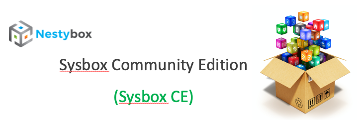
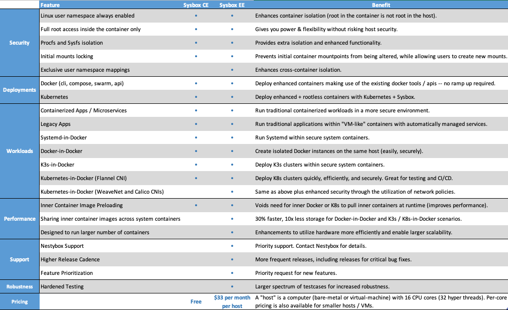

<p align="center">
    
</p>

<p align="center">
    <a href="https://github.com/nestybox/sysbox/blob/master/LICENSE"></a>
    <a href="https://travis-ci.com/nestybox/sysbox">
    </a>
    <a href="https://nestybox-support.slack.com/join/shared_invite/enQtOTA0NDQwMTkzMjg2LTAxNGJjYTU2ZmJkYTZjNDMwNmM4Y2YxNzZiZGJlZDM4OTc1NGUzZDFiNTM4NzM1ZTA2NDE3NzQ1ODg1YzhmNDQ#">
    </a>
</p>

## Introduction

**Sysbox** is an open-source container runtime (aka runc), originally developed
by [Nestybox](https://www.nestybox.com), that enhances containers in two
key ways:

*   **Improves container isolation:** Sysbox always enables the Linux
    user-namespace on containers (i.e., root user in the container has zero
    privileges on the host), hides host info inside the container, locks the
    container's initial mounts, and more.

*   **Enables containers to act as VMs**: with Sysbox, containers become capable
    of running most workloads that run in physical hosts or VMs, including
    systemd, Docker, Kubernetes, and more, seamlessly and with proper isolation
    (no privileged containers, no complex images, no tricky entrypoints, no
    special volume mounts, etc.)

Sysbox is an OCI-based "runc", meaning that you typically use Docker and
Kubernetes to deploy these enhanced containers (in fact Sysbox works under the
covers, you don't interact with it directly).

Thus there is no need to learn new tools or modify your existing container
workflows to take advantage of Sysbox. Just install it and point your container
manager / orchestrator to it.

For example, this simple Docker command creates a container with Sysbox; you get
a well isolated container capable of seamlessly running most software that runs
in a VM (e.g., systemd, Docker, etc):

    $ docker run --runtime=sysbox-runc -it any_image

Sysbox was forked from the excellent [OCI runc][oci-runc] in early 2019, and has
undergone significant changes since then. It's written in Go, and it is
currently composed of three components: sysbox-runc, sysbox-fs, and
sysbox-mgr. More on Sysbox's design can be found in the [Sysbox user guide](docs/user-guide/design.md).

## Demo Videos

"VM-like" containers with Docker + Sysbox: https://asciinema.org/a/kkTmOxl8DhEZiM2fLZNFlYzbo

Rootless Kubernetes pods with Sysbox: https://asciinema.org/a/401488?speed=1.5

## Contents

*   [Motivation](#motivation)
*   [License](#license)
*   [Audience](#audience)
*   [Sysbox Features](#sysbox-features)
*   [System Containers](#system-containers)
*   [Host Requirements](#host-requirements)
*   [Installing Sysbox](#installing-sysbox)
*   [Using Sysbox](#using-sysbox)
*   [Documentation](#documentation)
*   [Performance](#performance)
*   [Under the Covers](#under-the-covers)
*   [Comparison to related technologies](#comparison-to-related-technologies)
*   [Contributing](#contributing)
*   [Troubleshooting & Support](#troubleshooting--support)
*   [Uninstallation](#uninstallation)
*   [Roadmap](#roadmap)
*   [Relationship to Nestybox](#relationship-to-nestybox)
*   [Contact](#contact)
*   [Thank You](#thank-you)

## Motivation

Sysbox solves problems such as:

*   Enhancing the isolation of containerized microservices
    (root in the container maps to an uprivileged user on the host).

*   Enabling a highly capable root user inside the container without
    compromising host security.

*   Securing CI/CD pipelines by enabling Docker-in-Docker or
    Kubernetes-in-Docker without insecure privileged containers.

*   Enabling the use of containers as "VM-like" environments for development,
    local testing, learning, etc., with strong isolation and the ability
    to run systemd, Docker, and even kubernetes inside the container.

*   Running legacy apps inside containers (instead of less efficient VMs).

*   Replacing VMs with an easier, faster, more efficient, and more portable
    container-based alternative, one that can be deployed across cloud
    environments easily.

*   Partitioning bare-metal hosts into multiple isolated compute environments
    with 2X the density of VMs (i.e., deploy twice as many VM-like containers
    as VMs on the same hardware at the same performance).

*   Partitioning cloud instances (e.g., EC2, GCP, etc.) into multiple isolated
    compute environments without resorting to expensive nested virtualization.

## License

Sysbox is an open-source project, licensed under the Apache License, Version
2.0. See the [LICENSE](LICENSE) file for details.

## Audience

The Sysbox project is intended for anyone looking to experiment, invent, learn,
and build systems using system containers. It's cutting-edge OS virtualization,
and contributions are welcomed.

The Sysbox project is **not** meant for people looking for a commercially
supported solution. For such a solution, use the **Sysbox Enterprise Edition
(Sysbox-EE)**.

Sysbox-EE uses Sysbox at its core, but complements it with enterprise-level
features for improved security and efficiency as well as Nestybox support
(see next section).

For more info on Sysbox-EE, refer to the [Nestybox website](https://www.nestybox.com).

## Sysbox Features

The table below summarizes the key features of the Sysbox container
runtime. It also provides a comparison between the Sysbox Community
Edition (i.e., this repo) and the Sysbox Enterprise Edition
(Sysbox EE).

<p align="center">
    
</p>

More on the features [here](docs/user-guide/features.md).

If you have questions, you can reach us [here](#contact).

## System Containers

We call the containers deployed by Sysbox **system containers**, to highlight the
fact that they can run not just micro-services (as regular containers do), but
also system software such as Docker, Kubernetes, Systemd, inner containers, etc.

More on system containers [here](docs/user-guide/concepts.md#system-container).

## Host Requirements

The Sysbox host must meet the following requirements:

*   It must be running of the [supported Linux distros](docs/distro-compat.md).

*   We recommend a minimum of 4 CPUs (e.g., 2 cores with 2 hyperthreads) and 4GB
    of RAM. Though this is not a hard requirement, smaller configurations may
    slow down Sysbox.

## Installing Sysbox

The method of installation depends on the environment where Sysbox will be
installed:

*   To install Sysbox on a Kubernetes cluster, use the [sysbox-deploy-k8s daemonset](docs/user-guide/install-k8s.md).

*   Otherwise, use the [Sysbox package](docs/user-guide/install-package.md) for
    your distro.

*   Alternativley, if a package for your distro is not yet available, or if you
    want to get the latest changes from upstream, you [build and install Sysbox from source](docs/developers-guide/README.md).

## Using Sysbox

Once Sysbox is installed, you create a container using your container manager
or orchestrator (e.g., Docker or Kubernetes) and an image of your choice.

Docker command example:

```console
$ docker run --runtime=sysbox-runc --rm -it --hostname my_cont registry.nestybox.com/nestybox/ubuntu-bionic-systemd-docker
root@my_cont:/#
```

Kubernetes pod spec example:

```yaml
apiVersion: v1
kind: Pod
metadata:
  name: ubu-bio-systemd-docker
  annotations:
    io.kubernetes.cri-o.userns-mode: "auto:size=65536"
spec:
  runtimeClassName: sysbox-runc
  containers:
  - name: ubu-bio-systemd-docker
    image: registry.nestybox.com/nestybox/ubuntu-bionic-systemd-docker
    command: ["/sbin/init"]
  restartPolicy: Never
```

You can choose whatever container image you want, Sysbox places no requirements
on the image.

The [Sysbox Quickstart Guide](docs/quickstart/README.md) has many usage examples.
You should start there to get familiarized with the use cases enabled by Sysbox.

## Documentation

We strive to provide good documentation; it's a key component of the Sysbox project.

We have several documents to help you get started and get the best out of
Sysbox.

*   [Sysbox Quick Start Guide](docs/quickstart/README.md)

    *   Provides many examples for using system containers. New users
        should start here.

*   [Sysbox User Guide](docs/user-guide/README.md)

    *   Provides more detailed information on Sysbox features and design.

*   [Sysbox Distro Compatibility Doc](docs/distro-compat.md)

    *   Distro compatibility requirements.

*   [Nestybox blog site](https://blog.nestybox.com/)

    *   Articles on using Sysbox to solve real-life problems.

## Performance

Sysbox is fast and efficient, as described in this [Nestybox blog post](https://blog.nestybox.com/2020/09/23/perf-comparison.html).

The containers created by Sysbox have similar performance to those created by
the OCI runc (the default runtime for Docker and Kubernetes).

Even containers deployed inside the system containers have excellent
performance, thought there is a slight overhead for network IO (as expected
since packets emitted by inner containers go through an additional network
interface / bridge inside the system container).

Now, if you use Sysbox to deploy system containers that replace VMs, then the
performance and efficiency gains are significant: you can deploy 2X as many
system containers as VMs on the same server and get the same performance, and do
this with a fraction of the memory and storage consumption. The blog post
referenced above has more on this.

## Under the Covers

Sysbox uses many OS-virtualization features of the Linux kernel and complements
these with OS-virtualization techniques implemented in user-space. These include
using all Linux namespaces (in particular the user-namespace), partial
virtualization of procfs and sysfs, selective syscall trapping, and more.

The [Sysbox User Guide](docs/user-guide/README.md) has more info on this.

### Sysbox does not use hardware virtualization

Though the containers generated by Sysbox resemble virtual machines in some ways
(e.g., you can run as root, run multiple services, and deploy Docker and K8s
inside), Sysbox does **not** use hardware virtualization. It's purely an
OS-virtualization technology meant to create containers that can run
applications as well as system-level software, easily and securely.

This makes the containers created by Sysbox fast, efficient, and portable.
Isolation wise, it's fair to say that they provide stronger isolation than
regular Docker containers (by virtue of using the Linux user-namespace), but
weaker isolation than VMs (by sharing the Linux kernel among containers).

## Comparison to related technologies

Sysbox is pretty unique: it is (to the best of our knowledge) the only OCI-based
container runtime that allows Docker and Kubernetes to deploy "VM-like"
containers capable of running systemd, Docker, K8s, etc., with ease and strong
isolation from the underlying host (i.e., no privileged containers).

See this [blog post](https://blog.nestybox.com/2020/10/06/related-tech-comparison.html) for a high-level comparison between Sysbox and related technologies
such as LXD, K8s.io KinD, Ignite, Kata Containers, rootless Docker, and more.

## Contributing

We welcome contributions to Sysbox, whether they are small documentation changes,
bug fixes, or feature additions. Please see the [contribution guidelines](CONTRIBUTING.md)
and [developer's guide](docs/developers-guide/README.md) for more info.

## Troubleshooting & Support

Refer to the [Troubleshooting document](docs/user-guide/troubleshoot.md)
and to the [issues](https://github.com/nestybox/sysbox/issues) for help.

Reach us at our [slack channel][slack] for any questions.

## Uninstallation

Prior to uninstalling Sysbox, make sure all containers deployed with it are
stopped and removed.

The method of uninstallation depends on the method used to install Sysbox:

*   To uninstall Sysbox on a Kubernetes cluster, follow [these instructions](docs/user-guide/install-k8s.md#uninstallation).

*   Otherwise, to uninstall the Sysbox package, follow [these instructions](docs/user-guide/install-package.md#uninstalling-sysbox).

*   If Sysbox was built and installed from source, follows [these instructions](docs/developers-guide/build.md#cleanup--uninstall).

## Roadmap

The following is a list of features in the Sysbox roadmap.

We list these here so that our users can get a better idea of where we
are going and can give us feedback on which of these they like best
(or least).

Here is a short list; the Sysbox issue tracker has many more.

*   Support for more Linux distros.

*   More improvements to procfs and sysfs virtualization.

*   Continued improvements to container isolation.

*   Exposing host devices inside system containers with proper permissions.

## Relationship to Nestybox

Sysbox was initially developed by [Nestybox](https://www.nestybox.com), and Nestybox is
the main sponsor of the Sysbox open-source project.

Having said this, we encourage participation from the community to help evolve
and improve it, with the goal of increasing the use cases and benefits it
enables. External maintainers and contributors are welcomed.

Nestybox uses Sysbox as the core of it's Sysbox enterprise product (Sysbox-EE),
which consists of Sysbox plus proprietary features meant for enterprise use.

To ensure synergy between the Sysbox project and commercial entities such as
Nestybox, we use the following criteria when considering adding functionality to
Sysbox:

Any features that mainly benefit individual practitioners are made part of the
Sysbox open-source project. Any features that mainly address enterprise-level
needs are reserved for the Sysbox Enterprise Edition.

The Sysbox project maintainers will make this determination on a feature by
feature basis, with total transparency. The goal is to create a balanced
approach that enables the Sysbox open-source community to benefit and thrive
while creating opportunities for Nestybbox to create a healthy viable business
around the technology.

## Contact

Slack: [Nestybox Slack Workspace][slack]

Email: contact@nestybox.com

We are available from Monday-Friday, 9am-5pm Pacific Time.

## Thank You

We thank you **very much** for using and/or contributing to Sysbox. We hope you
find it interesting and that it helps you use containers in new and more powerful
ways.

[slack]: https://nestybox-support.slack.com/join/shared_invite/enQtOTA0NDQwMTkzMjg2LTAxNGJjYTU2ZmJkYTZjNDMwNmM4Y2YxNzZiZGJlZDM4OTc1NGUzZDFiNTM4NzM1ZTA2NDE3NzQ1ODg1YzhmNDQ#/

[perf-blog]: https://blog.nestybox.com/2020/09/23/perf-comparison.html

[oci-runc]: https://github.com/opencontainers/runc
