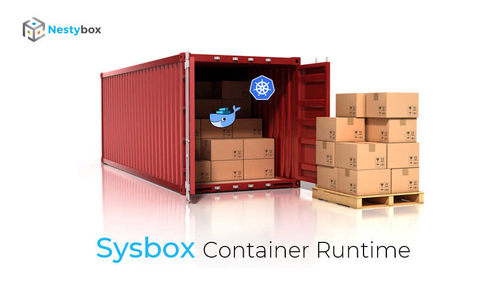

<p align="center"></p>

## Contents

-   [Introduction](#introduction)
-   [System Containers](#system-containers)
-   [License](#license)
-   [Audience](#audience)
-   [Supported Distros](#supported-distros)
-   [Host Requirements](#host-requirements)
-   [Building Sysbox](#building-sysbox)
-   [Launching a System Container](#launching-a-system-container)
-   [Sysbox Features](#sysbox-features)
-   [Documentation](#documentation)
-   [Integration with Container Managers & Orchestrators](#integration-with-container-managers--orchestrators)
-   [Sysbox is not Rootless Docker](#sysbox-is-not-rootless-docker)
-   [Sysbox does not use hardware virtualization](#sysbox-does-not-use-hardware-virtualization)
-   [Contributing](#contributing)
-   [Filing Issues](#filing-issues)
-   [Troubleshooting & Support](#troubleshooting--support)
-   [Roadmap](#roadmap)
-   [Relationship to Nestybox](#relationship-to-nestybox)
-   [Uninstallation](#uninstallation)
-   [Contact](#contact)
-   [Thank You](#thank-you)

## Introduction

This is the Sysbox project's repo.

**Sysbox** is an open-source, next-generation container runtime (aka runc)
originally developed by [Nestybox](https://www.nestybox.com).

Sysbox enables Docker (or more accurately OCI-based) containers to act as
virtual servers with full root access and capable of running software such as
Systemd, Docker, and Kubernetes in them, **seamlessly and securely**.

Prior to Sysbox, running such software in a container required complex images,
custom entrypoints, special volume mounts, and very unsecure privileged
containers.

Sysbox overcomes these problems by creating the container in such a way that the
above mentioned software runs normally inside of it, using simple container
images and with strong isolation. Sysbox voids the need for unsecure privileged
containers in most cases.

Sysbox was forked from the OCI runc in early 2019, and has undergone significant
changes since then. It's currently composed of 3 components: sysbox-runc,
sysbox-fs, and sysbox-mgr. It's mostly written in [Go](https://golang.org/).
More on this can be found in Sysbox's design guide.

TODO: add link to design guide.

Sysbox sits below container managers such as Docker / containerd, allowing you
to use these well known tools to deploy the containers. No need to learn new tools.

We have some sample videos showing Sysbox in action:

-   [Docker Sandboxing](https://asciinema.org/a/kkTmOxl8DhEZiM2fLZNFlYzbo?speed=2)

-   [Kubernetes-in-Docker](https://asciinema.org/a/V1UFSxz6JHb3rdHpGrnjefFIt?speed=1.75)

The complete list of features is [here](#sysbox-features).

## System Containers

We call the containers deployed by Sysbox **system containers**, to highlight the
fact that they can run not just micro-services (as regular containers do), but
also system software such as Docker, Kubernetes, Systemd, inner containers, etc.

More on system containers [here](docs/user-guide/concepts.md#system-container).

## License

Sysbox is an open-source project, licensed under the Apache License, Version
2.0. See the [LICENSE](LICENSE) file for details.

## Audience

The Sysbox project is intended for anyone looking to experiment, invent, learn,
and build systems using system containers. Contributions are welcomed!

The Sysbox project is **not meant** for people looking for a commercially
supported solution. For a example of such a solution, refer to
the [Nestybox website](https://www.nestybox.com).

See [here](#relationship-to-nestybox) for more on the relationship between
the Sysbox project and Nestybox.

## Supported Distros

Sysbox relies on functionality that is currently only present in Ubuntu Linux.

See the [distro compatibility doc](docs/distro-compat.md) for information on what versions
of Ubuntu kernels are supported.

We plan to add support for more distros in the near future.

## Host Requirements

The Linux host on which Sysbox runs must meet the following requirements:

1) It must have one of the supported Linux distros.

2) Docker must be [installed natively](docs/user-guide/install.md#docker-installation) (**not** with the Docker snap package).

## Installing Sysbox

Before you can use Sysbox, you must first install it on your Linux machine.

There are two ways:

1) You can download a free packaged version from the [Nestybox website](https://www.nestybox.com). This is the
   easiest approach if you are just looking to use Sysbox.

2) You can build it from source and install it. This is the best approach if you are looking for a deeper
   dive or if you want to [contribute](#contributing) to Sysbox.

## Using Sysbox

Once Sysbox is installed, you launch a system container with Docker as follows:

```console
$ docker run --runtime=sysbox-runc --rm -it --hostname my_cont debian:latest
root@my_cont:/#
```

This launches a system container. Looks very much like a regular container,
except that within it you can now run system software such as Systemd, Docker,
Kubernetes, etc., seamlessly and securely (no privileged containers!).

The [Sysbox Quickstart Guide](docs/quickstart/README.md) has many usage examples.
You should start there to get familiarized with the use cases enabled by Sysbox.

Note that if you omit the `--runtime` option, Docker will use its default `runc`
runtime to launch regular containers (rather than system containers). It's
perfectly fine to run system containers launched with Docker + Sysbox alongside
regular Docker containers; they won't conflict and can co-exist side-by-side.

## Sysbox Features

### Integrates with Docker

-   Launch system containers via the Docker CLI, using simple Docker images.

### Systemd-in-Docker

-   Run Systemd inside a Docker container easily, without complex container configurations.

-   Enables you to containerize apps that rely on Systemd.

### Docker-in-Docker

-   Run Docker inside a container easily and without unsecure privileged containers.

-   Full isolation between the Docker inside the container and the Docker on the host.

### Kubernetes-in-Docker

-   Deploy Kubernetes (K8s) inside containers with proper isolation (no privileged containers)
    and using simple Docker images and Docker run commands (no need for custom Docker images
    with tricky entrypoints).

-   Very efficient: a 10-node K8s cluster deploys in under 2 minutes and
    consumes only 1GB of storage overhead.

-   Deploy with simple `docker run` commands for full flexibility, or using a
    higher level tool (e.g., such as [kindbox](https://github.com/nestybox/kindbox)).

### Strong container isolation

-   Avoid the need for unsecure privileged containers.

-   Root user in the system container maps to a fully unprivileged user on the host.

-   Each system container gets exclusive range of host user IDs (for increased
    cross-container isolation).

-   Programs running inside the system container (e.g., Docker, Kubernetes, etc)
    are limited to using the resources given to the system container itself.

### Fast & Efficient

-   Sysbox uses host resources optimally to reduce container startup time and host
    storage overhead.

### Easily preload inner container images into the system container image.

-   Using a simple Dockerfile or Docker commit.

Please see our [Roadmap](#roadmap) for a list of features we are working on.

## Documentation

We have several documents to help you get started and get the best out of
system containers.

-   [Sysbox Quick Start Guide](docs/quickstart/README.md)

    -   Provides many examples for using system containers. New users
        should start here.

-   [Sysbox Distro Compatibility Doc](docs/distro-compat.md)

    -   Distro compatibility requirements.

-   [Sysbox User Guide](docs/user-guide/README.md)

    -   Provides more detailed information on Sysbox features.

## Integration with Container Managers & Orchestrators

Though Sysbox is OCI-based (and thus compatible with OCI container managers),
it's currently only tested with Docker / containerd.

In particular, we don't yet support using Kubernetes to deploy system containers
with Sysbox (though we [plan to](#roadmap)).

## Sysbox is not Rootless Docker

Sysbox often gets confused with [Rootless Docker](https://docs.docker.com/engine/security/rootless/), but it's in
fact very different.

Rootless Docker aims to run the Docker daemon in the host without root
privileges, to mitigate security risks. This however results in a number of
[limitations](https://docs.docker.com/engine/security/rootless/#known-limitations)
on what the Docker daemon can do.

Sysbox aims to create containers that can run any system software in them easily
and securely. The Docker on the host, as well as Sysbox, require root privileges
to make this possible. Within the containers however, you can run Docker and Kubernetes,
and they will only have privileges within the containers but none on the host.

What Rootless Docker and Sysbox have in common is that both use the Linux
user-namespace for isolation, but do so in different ways.

## Sysbox does not use hardware virtualization

Though the containers generated by Sysbox resemble virtual machines in some ways
(e.g., you can run as root, run multiple services, and deploy Docker and K8s
inside), Sysbox does not use hardware virtualization. It's purely an
OS-virtualization technology meant to create containers that can run
applications as well as system-level software, easily and securely.

Sysbox uses isolation features of the Linux kernel (e.g., namespaces, cgroups),
and complements these with advanced OS virtualization techniques such as partial
virtualization of procfs and sysfs, selective syscall interception, and more in
order to create the container abstraction.

This makes the containers created by Sysbox very fast, efficient, and
portable. Isolation wise, it's fair to say that they provide stronger isolation
than regular Docker containers (by virtue of using the Linux user-namespace),
but weaker isolation than VMs (by sharing the Linux kernel among containers).

## Contributing

We welcome contributions to Sysbox, whether they be small documentation changes,
bug fixes, or feature additions. Please see the [contribution guidelines](CONTRIBUTING.md)
and [developer's guide](docs/developers-guide.md) for more info.

## Filing Issues

We apologize for any problems in Sysbox or its documentation, and we appreciate
people filing issues that help us improve the software.

Please see the [contribution guidelines](CONTRIBUTING.md) for info on how
to report issues.

## Troubleshooting & Support

Refer to the [Troubleshooting document](docs/user-guide/troubleshoot.md)
and to the [issues](https://github.com/nestybox/sysbox/issues) for help.

Reach us at our [slack channel][slack] or at `contact@nestybox.com` for any questions.
See our [contact info](#contact) below for more options.

TODO: create a Sysbox OSS slack channel, add info here instead of Nestybox's.

## Roadmap

The following is a list of features in the Sysbox roadmap.

We list these here so that our users can get a better idea of where we
are going and can give us feedback on which of these they like best
(or least).

Here is a short list; the Sysbox issue tracker has many more.

-   Support for more Linux distros.

-   Support for the Docker snap package.

-   Support for deploying system containers with Kubernetes.

-   Exposing host devices inside system containers.

-   Continued improvements to container isolation.

## Relationship to Nestybox

Sysbox was initially developed by Nestybox, and Nestybox is the main sponsor of
the Sysbox open-source project.

Having said this, Sysbox is a self-governed open-source project, and we encourage
participation from the community to help evolve and improve it. External
maintainers and contributors are welcomed.

Nestybox uses Sysbox as the core of it's Sysbox enterprise product, which
consists of Sysbox plus proprietary features meant for enterprise use.

To ensure synergy between the Sysbox project and companies such as Nestybox, we
use the following criteria when considering adding functionality to Sysbox:

Any features that mainly benefit individual practitioners are made part of the Sysbox
open-source project. Any features that mainly address enterprise-level needs are
not part of the Sysbox open-source project.

This way, the Sysbox open source project satisfies the needs of individual
practitioners while giving companies such as Nestybox the chance to monetize on
enterprise-level features (which in turn enables Nestybox to continue to sponsor
the Sysbox open source project).

## Uninstallation

Prior to uninstalling Sysbox, make sure all system containers are removed.
There is a simple shell script to do this [here](scr/rm_all_syscont).

TODO: add uninstall instructions

## Contact

TODO: add slack channel contact info

Slack: [Nestybox Slack Workspace][slack]

We are there from Monday-Friday, 9am-5pm Pacific Time.

## Thank You

We thank you **very much** for trying Sysbox. We hope you find it useful!
