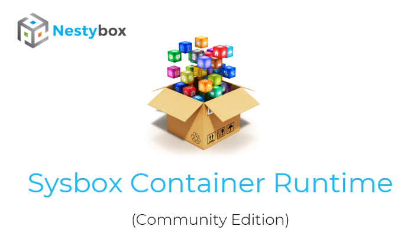
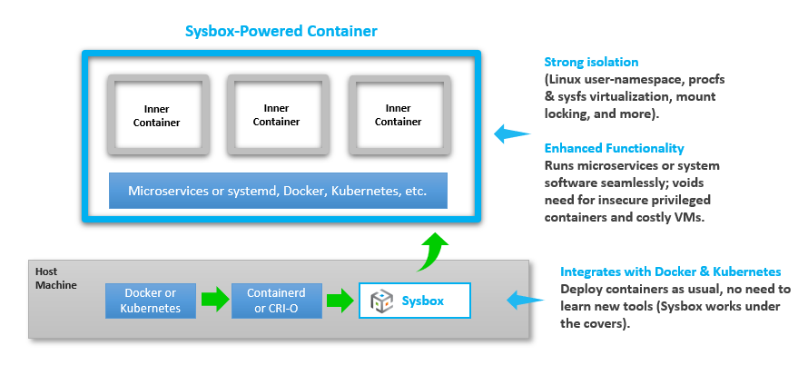
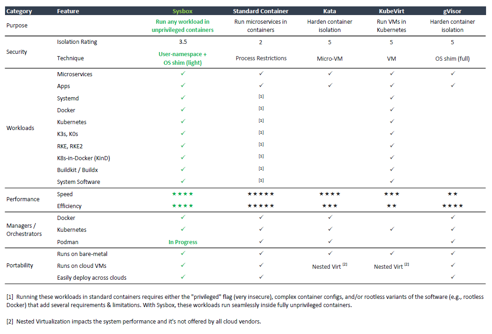

<p align="center">
    
</p>

<p align="center">
    <a href="https://github.com/nestybox/sysbox/blob/master/LICENSE"></a>
    <a href="https://travis-ci.com/nestybox/sysbox">
    </a>
    <a href="https://nestybox-support.slack.com/join/shared_invite/enQtOTA0NDQwMTkzMjg2LTAxNGJjYTU2ZmJkYTZjNDMwNmM4Y2YxNzZiZGJlZDM4OTc1NGUzZDFiNTM4NzM1ZTA2NDE3NzQ1ODg1YzhmNDQ#">
    </a>
</p>

## Introduction

**Sysbox** is an open-source and free container runtime (a specialized "runc"),
originally developed by Nestybox ([acquired by Docker][docker-acquisition] on
05/2022), that enhances containers in two key ways:

*   **Improves container isolation:**

    *   Linux user-namespace on all containers (i.e., root user in the container
        has zero privileges on the host).

    *   Virtualizes portions of procfs & sysfs inside the container.

    *   Hides host info inside the container.

    *   Locks the container's initial mounts, and more.

*   **Enables containers to run same workloads as VMs**:

    *   With Sysbox, containers can run system-level software such as systemd,
        Docker, Kubernetes, K3s, buildx (including multi-arch builds), legacy
        apps, multi-arch apps, and more seamlessly & securely.

    *   This software can run inside Sysbox containers without modification and
        without using special versions of the software (e.g., rootless
        variants).

    *   No privileged containers, no complex images, no tricky entrypoints, no
        special volume mounts, etc.

Think of it as a **"container supercharger"**: it enables your existing container
managers / orchestrators (e.g., Docker, Kubernetes, etc.) to deploy containers
that have hardened isolation and can run almost any workload that runs in VMs.

Sysbox does this by making the container resemble a VM-like environment as much
as possible, using advanced OS virtualization techniques.

Unlike alternative runtimes such as Kata and KubeVirt, **it does not use VMs**.
This makes it easier to use (particularly in cloud environments by avoiding
nested virtualization), although it does not provide the level of isolation
that VM-based runtimes do. See [here](#comparison-to-related-technologies) for a
comparison.

There is no need to learn new tools or modify your existing container images or
workflows to take advantage of Sysbox. Simply install it and point your container
manager / orchestrator to it to deploy enhanced containers.

Sysbox can live side-by-side with other container runtimes on the same host
(e.g., the default OCI runc, Kata, etc.) You can easily choose which containers
or pods to run with each, depending on your needs.

## Demo Videos

*   ["VM-like" containers with Docker + Sysbox](https://asciinema.org/a/kkTmOxl8DhEZiM2fLZNFlYzbo?speed=2)

*   [Rootless Kubernetes pods with Sysbox](https://asciinema.org/a/401488?speed=1.5)

## Contents

*   [License](#license)
*   [Relationship to Nestybox & Docker](#relationship-to-nestybox--docker)
*   [Motivation](#motivation)
*   [How it Works](#how-it-works)
*   [Comparison to Related Technologies](#comparison-to-related-technologies)
*   [Audience](#audience)
*   [Sysbox Enterprise Edition](#sysbox-enterprise-edition)
*   [Sysbox Features](#sysbox-features)
*   [System Containers](#system-containers)
*   [Installation](#installation)
*   [Using Sysbox](#using-sysbox)
*   [Documentation](#documentation)
*   [Performance](#performance)
*   [Under the Covers](#under-the-covers)
*   [Contributing](#contributing)
*   [Security](#security)
*   [Troubleshooting & Support](#troubleshooting--support)
*   [Uninstallation](#uninstallation)
*   [Roadmap](#roadmap)
*   [Contact](#contact)
*   [Thank You](#thank-you)

## License

Sysbox is free and open-source, licensed under the Apache License,
Version 2.0. See the [LICENSE](LICENSE) file for details.

## Relationship to Nestybox & Docker

Sysbox was originally developed by Nestybox. As [Nestybox is now part of
Docker][docker-acquisition], Docker is the main sponsor of the Sysbox project.

Having said this, Sysbox is a community open-source project and it's **not
officially supported by Docker** (i.e., Docker subscriptions do not include
Sysbox support).  Support is provided on a **best effort basis** via this Github
repo or via the [Sysbox Slack Workspace][slack].

We encourage participation from the community to help evolve and improve Sysbox,
with the goal of increasing the use cases and benefits it enables. External
maintainers and contributors are welcomed.

## Motivation

Sysbox solves problems such as:

*   Enhancing the isolation of containerized microservices
    (root in the container maps to an unprivileged user on the host).

*   Enabling a highly capable root user inside the container without
    compromising host security.

*   Securing CI/CD pipelines by enabling Docker-in-Docker (DinD) or
    Kubernetes-in-Docker (KinD) without insecure privileged containers
    or host Docker socket mounts.

*   Enabling the use of containers as "VM-like" environments for development,
    local testing, learning, etc., with strong isolation and the ability
    to run systemd, Docker, IDEs, and more inside the container.

*   Running legacy apps inside containers (instead of less efficient VMs).

*   Replacing VMs with an easier, faster, more efficient, and more portable
    container-based alternative, one that can be deployed across cloud
    environments easily.

*   Partitioning bare-metal hosts into multiple isolated compute environments
    with 2X the density of VMs (i.e., deploy twice as many VM-like containers
    as VMs on the same hardware at the same performance).

*   Partitioning cloud instances (e.g., EC2, GCP, etc.) into multiple isolated
    compute environments without resorting to expensive nested virtualization.

## How it Works

<p align="center">
    
</p>

Sysbox [installs easily](#installation) on Linux hosts (bare-metal, VM, on-prem, cloud, etc.). It
works on all mayor cloud-based IaaS and Kubernetes services (e.g., EC2, GCP, GKE,
EKS, AKS, Rancher, etc.)

Once installed, Sysbox works under the covers: you use Docker, Kubernetes, etc.
to deploy containers with it.

For example, this simple Docker command creates a container with Sysbox:

    $ docker run --runtime=sysbox-runc -it any_image

You get a well isolated container capable of seamlessly running microservices as
well as system-level software that normally that runs on VMs (e.g., systemd,
Docker, Kubernetes, etc).

More on how to use Sysbox [here](#using-sysbox).

## Comparison to Related Technologies

<p align="center">
    
</p>

As shown, Sysbox enables unprivileged containers to run system-level workloads
such as systemd, Docker, Kubernetes, etc., seamlessly, while giving you a
balanced approach between container isolation, performance, efficiency, and
portability.

And it does this with minimal configuration changes to your existing infra: just
install Sysbox and configure your container manager/orchestrator to launch
containers with it, using the image of your choice.

Note that while Sysbox hardens the isolation of standard containers and voids
the need for insecure privileged containers in many scenarios, it does not (yet)
provide the same level of isolation as VM-based alternatives or user-space OSes
like gVisor. Therefore, for scenarios where the highest level of isolation is
required, alternatives such as KubeVirt may be preferable (at the expense of
lower performance and efficiency and higher complexity and cost).

See this [blog post](https://blog.nestybox.com/2020/10/06/related-tech-comparison.html) for
more.

## Audience

The Sysbox project is intended for anyone looking to experiment, invent, learn,
and build systems using [system containers](#system-containers). It's
cutting-edge OS virtualization, and contributions are welcomed.

## Sysbox Enterprise Edition [DEPRECATED]

Prior to the [acquisition by Docker][docker-acquisition] on 05/2022, Nestybox
offered [Sysbox Enterprise][sysbox-ee-repo] as an enhanced version of Sysbox
(e.g., more security, more workloads, and official support).

After the acquisition however, Sysbox Enterprise is no longer offered as a
standalone product but has instead been incorporated into [Docker Desktop](https://www.docker.com/products/docker-desktop/)
(see [Docker Hardened Desktop](https://docs.docker.com/desktop/hardened-desktop/)).

**NOTE:** As Sysbox Enterprise is no longer offered as a standalone product, Docker
plans to make some Sysbox Enterprise features available in Sysbox Community
Edition. The features are TBD and [your feedback](#contact) on this is welcome.

## Sysbox Features

The table below summarizes the key features of the Sysbox container runtime.

It also provides a comparison between the Sysbox Community Edition (i.e., this
repo) and the previously available Sysbox Enterprise Edition (now deprecated).

<p align="center">
    
</p>

More on the Sysbox features [here](docs/user-guide/features.md).

If you have questions, you can reach us [here](#contact).

## System Containers

We call the containers deployed by Sysbox **system containers**, to highlight the
fact that they can run not just micro-services (as regular containers do), but
also system software such as Docker, Kubernetes, Systemd, inner containers, etc.

More on system containers [here](docs/user-guide/concepts.md#system-container).

## Installation

### Host Requirements

The Sysbox host must meet the following requirements:

*   It must be running one of the [supported Linux distros](docs/distro-compat.md)
    and be a machine with a [supported architecture](docs/arch-compat.md) (e.g., amd64, arm64).

*   We recommend a minimum of 4 CPUs (e.g., 2 cores with 2 hyperthreads) and 4GB
    of RAM. Though this is not a hard requirement, smaller configurations may
    slow down Sysbox.

### Installing Sysbox

The method of installation depends on the environment where Sysbox will be
installed:

*   To install Sysbox on a Kubernetes cluster, use the [sysbox-deploy-k8s daemonset](docs/user-guide/install-k8s.md).

*   Otherwise, use the [Sysbox package](docs/user-guide/install-package.md) for
    your distro.

*   Alternatively, if a package for your distro is not yet available, or if you
    want to get the latest changes from upstream, you can [build and install Sysbox from source](docs/developers-guide/README.md).

## Using Sysbox

Once Sysbox is installed, you create a container using your container manager
or orchestrator (e.g., Docker or Kubernetes) and an image of your choice.

Docker command example:

```console
$ docker run --runtime=sysbox-runc --rm -it --hostname my_cont registry.nestybox.com/nestybox/ubuntu-bionic-systemd-docker
root@my_cont:/#
```

Kubernetes pod spec example:

```yaml
apiVersion: v1
kind: Pod
metadata:
  name: ubu-bio-systemd-docker
  annotations:
    io.kubernetes.cri-o.userns-mode: "auto:size=65536"
spec:
  runtimeClassName: sysbox-runc
  containers:
  - name: ubu-bio-systemd-docker
    image: registry.nestybox.com/nestybox/ubuntu-bionic-systemd-docker
    command: ["/sbin/init"]
  restartPolicy: Never
```

You can choose whatever container image you want, Sysbox places no requirements
on the image.

Nestybox makes several reference images available in its [Dockerhub](https://hub.docker.com/u/nestybox)
and [GitHub Container Registry](https://github.com/orgs/nestybox/packages) repos. These are
images that typically include systemd, Docker, Kubernetes, and more inside the containers.
The Dockerfiles are [here](https://github.com/nestybox/dockerfiles/tree/master). Feel free
to use and modify per your needs.

## Documentation

We strive to provide good documentation; it's a key component of the Sysbox project.

We have several documents to help you get started and get the best out of
Sysbox.

*   [Sysbox Distro Compatibility Doc](docs/distro-compat.md)

    *   Distro compatibility requirements. Check this out before installing Sysbox.

*   [Sysbox Quick Start Guide](docs/quickstart/README.md)

    *   Provides many examples for using Sysbox. New users should start here.

*   [Sysbox User Guide](docs/user-guide/README.md)

    *   Provides more detailed information on Sysbox installation,
        configuration, features and design.

*   [Nestybox blog site](https://blog.nestybox.com/)

    *   Articles on using Sysbox to solve real-life problems.

## Performance

Sysbox is fast and efficient, as described in this [Nestybox blog post](https://blog.nestybox.com/2020/09/23/perf-comparison.html).

The containers created by Sysbox have similar performance to those created by
the OCI runc (the default runtime for Docker and Kubernetes).

Even containers deployed inside the system containers have excellent
performance, thought there is a slight overhead for network IO (as expected
since packets emitted by inner containers go through an additional network
interface / bridge inside the system container).

Now, if you use Sysbox to deploy system containers that replace VMs, then the
performance and efficiency gains are significant: you can deploy 2X as many
system containers as VMs on the same server and get the same performance, and do
this with a fraction of the memory and storage consumption. The blog post
referenced above has more on this.

## Under the Covers

Sysbox was forked from the excellent [OCI runc][oci-runc] in early 2019 and it
stands on the shoulders of the work done by the OCI runc developers.

Having said this, Sysbox adds significant functionality on top. It's written in
Go, and it is currently composed of three components: sysbox-runc, sysbox-fs,
and sysbox-mgr.

Sysbox uses many OS-virtualization features of the Linux kernel and complements
these with OS-virtualization techniques implemented in user-space. These include
using all Linux namespaces (in particular the user-namespace), partial
virtualization of procfs and sysfs, selective syscall trapping, and more.

More on Sysbox's design can be found in the [Sysbox user guide](docs/user-guide/design.md).

### Sysbox does not use hardware virtualization

Though the containers generated by Sysbox resemble virtual machines in some ways
(e.g., you can run as root, run multiple services, and deploy Docker and K8s
inside), Sysbox does **not** use hardware virtualization.

Sysbox is a pure OS-virtualization technology meant to create containers that
can run applications as well as system-level software, easily and securely.

This makes the containers created by Sysbox fast, efficient, and portable (i.e.,
they aren't tied to a hypervisor).

Isolation wise, it's fair to say that Sysbox containers provide stronger
isolation than regular Docker containers (by virtue of using the Linux
user-namespace and light-weight OS shim), but weaker isolation than VMs (by
sharing the Linux kernel among containers).

## Contributing

We welcome contributions to Sysbox, whether they are small documentation changes,
bug fixes, or feature additions. Please see the [contribution guidelines](CONTRIBUTING.md)
and [developer's guide](docs/developers-guide/README.md) for more info.

## Security

See the User Guide's [Security Chapter](docs/user-guide/security.md) for
info on how Sysbox secures containers.

If you find bugs or issues that may expose a Sysbox vulnerability, please report
these by sending an email to security@nestybox.com. Please do not open security
issues in this repo. Thanks!

In addition, a few vulnerabilities have recently been found in the Linux kernel
that in some cases reduce or negate the enhanced isolation provided by Sysbox
containers. Fortunately they are all fixed in recent Linux kernels. See the
Sysbox User Guide's [Vulnerabilities & CVEs chapter](docs/user-guide/security-cve.md)
for more info, and reach out on the [Sysbox Slack channel][slack] for further questions.

## Troubleshooting & Support

Support is currently offered on a best-effort basis.

If you have a question or comment, we love to hear it. You can reach us at our
[slack channel][slack] or file an issue on this GitHub repo.

If you spot a problem with Sysbox, please search the existing
[issues](https://github.com/nestybox/sysbox/issues) as they may describe the
problem and provide a work-around.

Check also the [Troubleshooting document](docs/user-guide/troubleshoot.md).

## Uninstallation

Prior to uninstalling Sysbox, make sure all containers deployed with it are
stopped and removed.

The method of uninstallation depends on the method used to install Sysbox:

*   To uninstall Sysbox on a Kubernetes cluster, follow [these instructions](docs/user-guide/install-k8s.md#uninstallation).

*   Otherwise, to uninstall the Sysbox package, follow [these instructions](docs/user-guide/install-package.md#uninstallation).

*   If Sysbox was built and installed from source, follow [these instructions](docs/developers-guide/build.md#cleanup--uninstall).

## Roadmap

The following is a list of features in the Sysbox roadmap.

We list these here so that our users can get a better idea of where we
are going and can give us feedback on which of these they like best
(or least).

Here is a short list; the Sysbox issue tracker has many more.

*   Support for more Linux distros.

*   More improvements to procfs and sysfs virtualization.

*   Continued improvements to container isolation.

*   Exposing host devices inside system containers with proper permissions.

## Contact

Slack: [Sysbox Slack Workspace][slack]

Email: contact@nestybox.com

We are available from Monday-Friday, 9am-5pm Pacific Time.

## Thank You

We thank you **very much** for using and/or contributing to Sysbox. We hope you
find it interesting and that it helps you use containers in new and more powerful
ways.

[slack]: https://nestybox-support.slack.com/join/shared_invite/enQtOTA0NDQwMTkzMjg2LTAxNGJjYTU2ZmJkYTZjNDMwNmM4Y2YxNzZiZGJlZDM4OTc1NGUzZDFiNTM4NzM1ZTA2NDE3NzQ1ODg1YzhmNDQ#/

[perf-blog]: https://blog.nestybox.com/2020/09/23/perf-comparison.html

[oci-runc]: https://github.com/opencontainers/runc

[sysbox-ee-repo]: https://github.com/nestybox/sysbox-ee

[docker-acquisition]: https://www.docker.com/blog/docker-advances-container-isolation-and-workloads-with-acquisition-of-nestybox/

[docker-desktop]: https://www.docker.com/products/
