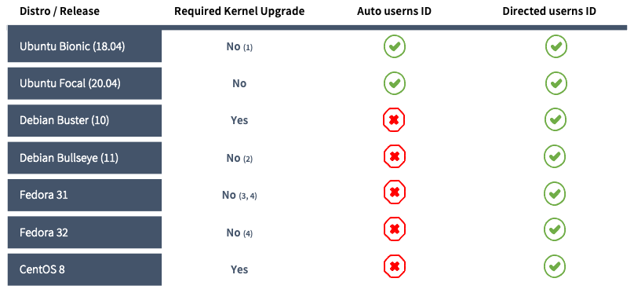

# Sysbox Distro Compatibility

## Contents

-   [Supported Linux Distros](#supported-linux-distros)
-   [Sysbox Operational Modes](#Sysbox-Operational-Modes)
-   [Kernel Upgrade Procedures](#Kernel-Upgrade-Procedures)

## Supported Linux Distros

Sysbox relies on functionality that is only present in recent Linux kernels.

In Ubuntu's case, these requirements are met starting with Kernel 5.0. For
the rest of the Sysbox's supported distributions, Kernel 5.5+ is required.

The following table summarizes the Linux distributions being supported, as well
as the operational modes utilized to manage the [user-namespace ID mappings](user-guide/security.md#user-namespace-id-mapping)
(i.e. `automatic` vs `directed`).

For scenarios where a kernel upgrade is required, refer to the corresponding
upgrade procedure further below.

<p align="center">
    
</p>

* Note 1: Ubuntu Bionic requires no kernel upgrade in scenarios where relatively
recent releases have been installed (i.e. 18.04.4+). If that's not the
case, user will need to upgrade the kernel. Refer to [Ubuntu's kernel-upgrade](#Ubuntu-Kernel-Upgrade)
procedure for details.

* Note 2: Fedora 31 requires no kernel upgrade assuming that user is running a recent
installation (i.e. kernel 5.5+ is deployed). Otherwise, a kernel-upgrade will be
expected. Refer to [Fedora's kernel-upgrade](#Fedora-kernel-upgrade) procedure for details.

## Sysbox Operational Modes

The Sysbox runtime relies on the kernel's user-namespace feature to secure
system containers. There are two approaches utilized by Sysbox to manage the
creation of these user-namespaces: `automatic` and `directed`.

It is important to highlight that this operational mode is per individual
container. That is, a container-manager (e.g. Docker, K8s/Cri-o, Podman, etc)
could instruct Sysbox to operate in `directed` mode for any given container.

What follows is a high-level description of what each of these modes accomplish;
refer to the [user-guide](./user-guide/security.md#user-namespace-id-mapping) for
more details.

### Automatic userns ID mapping

In this mode Sysbox automatically allocates the ID mappings to be used by the
container. By doing this, Sysbox enforces strong container isolation without
requiring the higher level container-manager to do this explicitly (e.g. without
enabling `userns-remap` mode in Docker).

Sysbox will only attempt to operate in this mode if the received container
specification omits ID mappings configuration.

Note that this mode requires the presence of the `shiftfs` kernel module, which
currently is only available on the Ubuntu Linux distribution -- with the exception
of Ubuntu-cloud images deployed in some Cloud Providers.

### Directed userns ID mapping

In this mode Sysbox relies on the container-manager selecting the desired ID
mappings.

In Docker's case this is accomplished by enabling the `userns-remap` feature
which, even though imposes certain [restrictions](https://docs.docker.com/engine/security/userns-remap/#user-namespace-known-limitations),
it has no kernel requirements (i.e. `shiftfs`) and therefore allows Sysbox support
in a larger number of distributions.

Refer to the Sysbox [installation guide](./user-guide/install.md#docker-userns-remap)
for more details.

## Kernel Upgrade Procedures

### Ubuntu Kernel Upgrade

If you have a relatively old Ubuntu 18.04 release (e.g. 18.04.3), you need to upgrade the kernel to >= 5.0.

We recommend using Ubuntu's [LTS-enablement](https://wiki.ubuntu.com/Kernel/LTSEnablementStack) package to do the upgrade as follows:

```console
$ sudo apt-get update && sudo apt install --install-recommends linux-generic-hwe-18.04 -y

$ sudo shutdown -r now
```

### Debian Kernel Upgrade

This one is only required when running Debian Buster.

```
$ # Allow debian-backports utilization ...

$ echo deb http://deb.debian.org/debian buster-backports main contrib non-free | sudo tee /etc/apt/sources.list.d/buster-backports.list

$ sudo apt update

$ sudo apt install -t buster-backports linux-image-amd64

$ sudo shutdown -r now
```

Refer to this [link](https://wiki.debian.org/HowToUpgradeKernel) for more details.


### Fedora Kernel Upgrade

This is only applicable to Fedora 31 release; more recent releases already
include 5.5+ kernels.

```
$ sudo dnf config-manager --set-enabled kernel-vanilla-mainline

$ sudo dnf update

$ sudo shutdown -r now
```

Refer to this [link](https://www.cloudinsidr.com/content/how-to-upgrade-the-linux-kernel-in-fedora-29/) for more details.

### CentOS Kernel Upgrade

Applicable to CentOS 8 release.

```
$ sudo rpm --import https://www.elrepo.org/RPM-GPG-KEY-elrepo.org

$ sudo dnf install https://www.elrepo.org/elrepo-release-8.0-2.el8.elrepo.noarch.rpm

$ sudo dnf --enablerepo=elrepo-kernel install kernel-ml

$ sudo shutdown -r now
```

Refer to this [link](https://vitux.com/how-to-upgrade-the-kernel-on-centos-8-0/) for more details.