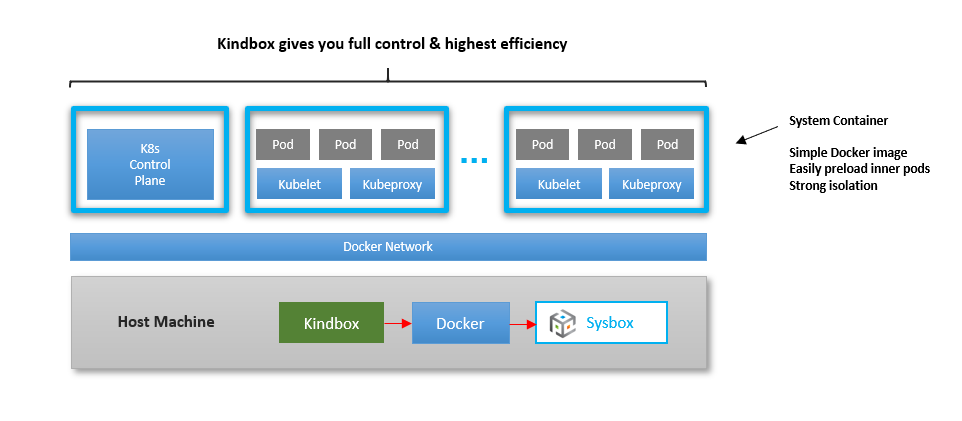

# Sysbox Quick Start Guide: Kubernetes-in-Docker

Since release v0.2.0, Sysbox has [preliminary support](../user-guide/kind.md#preliminary-support--known-limitations)
for running Kubernetes (K8s) inside system containers. This is known as
"Kubernetes-in-Docker".

This section shows several examples on how to do this.

The [User Guide](../user-guide/kind.md) describes this functionality in more
detail.

## Contents

-   [Why Sysbox for K8s-in-Docker?](#why-sysbox-for-k8s-in-docker)
-   [Using Docker to Deploy a K8s Cluster](#using-docker-to-deploy-a-k8s-cluster)
-   [Using Kindbox](#using-kindbox)
-   [Preloading Inner Pod Images into the K8s Node Image](#preloading-inner-pod-images-into-the-k8s-node-image)

## Why Sysbox for K8s-in-Docker?

Sysbox is the first container runtime capable of creating containers that can
run K8s seamlessly, using simple Docker images, no special configurations, and
strongly isolated containers (i.e,. using the Linux user-namespace).

There are currently two ways you can deploy the cluster:

-   Using simple "docker run" commands.

-   Using a higher layer tool such as Nestybox's [Kindbox](https://github.com/nestybox/kindbox) tool.

The sections below show examples of this.

## Using Docker to Deploy a K8s Cluster

Sysbox makes it easy to deploy a K8s cluster directly with simple "docker run"
commands.

**Check out this [video](https://asciinema.org/a/V1UFSxz6JHb3rdHpGrnjefFIt?speed=1.75).**

The upside is that you get full control of the cluster deployment. The drawback
is that you need to manage the K8s cluster creation sequence. But it's pretty
easy as you'll see.

Below is sample procedure to deploy a two-node K8s cluster. You can easily
extend it for larger clusters.

We will be using Docker image `nestybox/k8s-node:v1.18.2` for the K8s nodes
(same one we used in the prior section).

Here is the sequence:

1) Deploy the K8s control plane node:

```console
$ docker run --runtime=sysbox-runc -d --rm --name=k8s-master --hostname=k8s-master nestybox/k8s-node:v1.18.2
```

2) Start `kubeadm` inside the K8s control plane node.

NOTE: this command takes ~30 seconds on my laptop.

```console
$ docker exec k8s-master sh -c "kubeadm init --kubernetes-version=v1.18.2 --pod-network-cidr=10.244.0.0/16"

W0516 21:49:30.490317    1817 validation.go:28] Cannot validate kube-proxy config - no validator is available
W0516 21:49:30.490343    1817 validation.go:28] Cannot validate kubelet config - no validator is available
[init] Using Kubernetes version: v1.17.2
[preflight] Running pre-flight checks
[preflight] Pulling images required for setting up a Kubernetes cluster
[preflight] This might take a minute or two, depending on the speed of your internet connection
[preflight] You can also perform this action in beforehand using 'kubeadm config images pull'
[kubelet-start] Writing kubelet environment file with flags to file "/var/lib/kubelet/kubeadm-flags.env"
[kubelet-start] Writing kubelet configuration to file "/var/lib/kubelet/config.yaml"
[kubelet-start] Starting the kubelet
[certs] Using certificateDir folder "/etc/kubernetes/pki"
[certs] Generating "ca" certificate and key
[certs] Generating "apiserver" certificate and key

...

[kubelet-finalize] Updating "/etc/kubernetes/kubelet.conf" to point to a rotatable kubelet client certificate and key
[addons] Applied essential addon: CoreDNS
[addons] Applied essential addon: kube-proxy

Your Kubernetes control-plane has initialized successfully!

To start using your cluster, you need to run the following as a regular user:

mkdir -p $HOME/.kube
sudo cp -i /etc/kubernetes/admin.conf $HOME/.kube/config
sudo chown $(id -u):$(id -g) $HOME/.kube/config

You should now deploy a pod network to the cluster.
Run "kubectl apply -f [podnetwork].yaml" with one of the options listed at:
https://kubernetes.io/docs/concepts/cluster-administration/addons/

Then you can join any number of worker nodes by running the following on each as root:

kubeadm join 172.17.0.2:6443 --token zvgtem.nt4vng7nodm1jwh9 \
--discovery-token-ca-cert-hash sha256:fc343a4e18923e65ad180414fb71627ae43b9d82292f12b566e9ba33686d3a43
```

3) Next, setup kubectl on the host.

(This assumes you've [installed kubectl](https://kubernetes.io/docs/tasks/tools/install-kubectl/) on your host).

Copy the K8s `admin.conf` file from the container to the host:

```console
$ docker cp k8s-master:/etc/kubernetes/admin.conf $HOME/.kube/config
```

4) Now apply the CNI config. In this example we use [Flannel](https://github.com/coreos/flannel#flannel).

```console
$ kubectl apply -f https://raw.githubusercontent.com/coreos/flannel/master/Documentation/kube-flannel.yml

podsecuritypolicy.policy/psp.flannel.unprivileged created
clusterrole.rbac.authorization.k8s.io/flannel created
clusterrolebinding.rbac.authorization.k8s.io/flannel created
serviceaccount/flannel created
configmap/kube-flannel-cfg created
daemonset.apps/kube-flannel-ds-amd64 created
daemonset.apps/kube-flannel-ds-arm64 created
daemonset.apps/kube-flannel-ds-arm created
daemonset.apps/kube-flannel-ds-ppc64le created
daemonset.apps/kube-flannel-ds-s390x created
```

5) Verify all is good in the control-plane node:

```console
$ kubectl get all --all-namespaces

NAMESPACE     NAME                                     READY   STATUS    RESTARTS   AGE
kube-system   pod/coredns-6955765f44-czw7m             1/1     Running   0          9m14s
kube-system   pod/coredns-6955765f44-w9j2s             1/1     Running   0          9m14s
kube-system   pod/etcd-k8s-master                      1/1     Running   0          9m9s
kube-system   pod/kube-apiserver-k8s-master            1/1     Running   0          9m9s
kube-system   pod/kube-controller-manager-k8s-master   1/1     Running   0          9m9s
kube-system   pod/kube-flannel-ds-amd64-ps2z4          1/1     Running   0          60s
kube-system   pod/kube-proxy-fb2bd                     1/1     Running   0          9m14s
kube-system   pod/kube-scheduler-k8s-master            1/1     Running   0          9m8s

NAMESPACE     NAME                 TYPE        CLUSTER-IP   EXTERNAL-IP   PORT(S)                  AGE
default       service/kubernetes   ClusterIP   10.96.0.1    <none>        443/TCP                  9m31s
kube-system   service/kube-dns     ClusterIP   10.96.0.10   <none>        53/UDP,53/TCP,9153/TCP   9m30s

NAMESPACE     NAME                                     DESIRED   CURRENT   READY   UP-TO-DATE   AVAILABLE   NODE SELECTOR                 AGE
kube-system   daemonset.apps/kube-flannel-ds-amd64     1         1         1       1            1           <none>                        60s
kube-system   daemonset.apps/kube-flannel-ds-arm       0         0         0       0            0           <none>                        60s
kube-system   daemonset.apps/kube-flannel-ds-arm64     0         0         0       0            0           <none>                        60s
kube-system   daemonset.apps/kube-flannel-ds-ppc64le   0         0         0       0            0           <none>                        60s
kube-system   daemonset.apps/kube-flannel-ds-s390x     0         0         0       0            0           <none>                        60s
kube-system   daemonset.apps/kube-proxy                1         1         1       1            1           beta.kubernetes.io/os=linux   9m30s

NAMESPACE     NAME                      READY   UP-TO-DATE   AVAILABLE   AGE
kube-system   deployment.apps/coredns   2/2     2            2           9m30s

NAMESPACE     NAME                                 DESIRED   CURRENT   READY   AGE
kube-system   replicaset.apps/coredns-6955765f44   2         2         2       9m14s
```

NOTE: Wait for the `pod/coredns-*` pods to enter the "Running" state before
proceeding. It may take a few seconds.

5) Now start a K8s "worker node" by launching another system container with
   Docker + Sysbox (similar to step (1) above).

```console
$ docker run --runtime=sysbox-runc -d --rm --name=k8s-worker --hostname=k8s-worker nestybox/k8s-node:v1.18.2
```

6) Obtain the command that allows the worker join the cluster.

```console
$ join_cmd=$(docker exec k8s-master sh -c "kubeadm token create --print-join-command 2> /dev/null")

$ echo $join_cmd
kubeadm join 172.17.0.2:6443 --token 917kl0.xig3kbkv6ltc8qe6 --discovery-token-ca-cert-hash sha256:b64164e6ddc3ccbd65c71a04059f3db7ac4c57c9ad690621025b00f111883316
```

7) Tell the worker node to join the cluster:

NOTE: this command takes ~10 seconds to complete on my laptop.

```console
$ docker exec k8s-worker sh -c "$join_cmd"

W0516 22:07:52.240795    1366 join.go:346] [preflight] WARNING: JoinControlPane.controlPlane settings will be ignored when control-plane flag is not set.
[preflight] Running pre-flight checks
[preflight] Reading configuration from the cluster...
[preflight] FYI: You can look at this config file with 'kubectl -n kube-system get cm kubeadm-config -oyaml'
[kubelet-start] Downloading configuration for the kubelet from the "kubelet-config-1.17" ConfigMap in the kube-system namespace
[kubelet-start] Writing kubelet configuration to file "/var/lib/kubelet/config.yaml"
[kubelet-start] Writing kubelet environment file with flags to file "/var/lib/kubelet/kubeadm-flags.env"
[kubelet-start] Starting the kubelet
[kubelet-start] Waiting for the kubelet to perform the TLS Bootstrap...

This node has joined the cluster:
* Certificate signing request was sent to apiserver and a response was received.
* The Kubelet was informed of the new secure connection details.

Run 'kubectl get nodes' on the control-plane to see this node join the cluster.
```

Cool, the worker has joined.

8) Let's check that all looks good:

```console
$ docker ps
CONTAINER ID        IMAGE                       COMMAND             CREATED              STATUS              PORTS               NAMES
04aa10176cc1        nestybox/k8s-node:v1.18.2   "/sbin/init"        About a minute ago   Up About a minute   22/tcp              k8s-worker
f9e64edfc38e        nestybox/k8s-node:v1.18.2   "/sbin/init"        2 minutes ago        Up 2 minutes        22/tcp              k8s-master
```

```console
$ kubectl get nodes
NAME         STATUS   ROLES    AGE     VERSION
k8s-master   Ready    master   2m15s   v1.18.2
k8s-worker   Ready    <none>   27s     v1.18.2
```

NOTE: it may take several seconds for all nodes in the cluster to reach the
"Ready" status.

9) Now let's create a pod deployment:

```console
$ kubectl create deployment nginx --image=nginx
deployment.apps/nginx created

$ kubectl scale --replicas=4 deployment nginx
deployment.apps/nginx scaled

$ kubectl get pods
NAME                    READY   STATUS    RESTARTS   AGE
nginx-f89759699-bwsct   1/1     Running   0          15s
nginx-f89759699-kl6bm   1/1     Running   0          15s
nginx-f89759699-rd7xg   1/1     Running   0          15s
nginx-f89759699-s8nzz   1/1     Running   0          20s
```

Cool, the pods are running!

From here on you use `kubectl` to manage the K8s cluster as usual (deploy pods, services, etc.)

10) Just for fun, you can double-check the K8s nodes are unprivileged
    containers:

```console
$ docker exec k8s-master cat /proc/self/uid_map
0     165536      65536
```

This means that the root user in the container is mapped to unprivileged host
user-ID 165536.

11) After you are done, bring down the cluster:

```console
$ docker stop -t0 k8s-master k8s-worker
k8s-master
k8s-worker
```

As you can see, the procedure is pretty simple and can easily be extended for
larger clusters (simply add more master or worker nodes as needed).

All you needed was a bunch of `docker run` commands plus invoking `kubeadm`
inside the containers. In fact, the `kindbox` tool we describe in the next
section does basically this!

The procedure is analogous to the procedure you would use when installing K8s on a
cluster made up of physical hosts or VMs: install `kubeadm` on each K8s node and
use it to configure the control-plane and worker nodes.

The reason this works so simply: the Sysbox container runtime creates containers
that can run K8s seamlessly, much like a VM. Thus, a simple `docker run` and
`kubeadm init` is all you need to setup K8s inside the container.

### K8s Cluster on User-Defined Bridge Networks

In the example above, we deployed the K8s cluster inside Docker containers
connected to Docker's "bridge" network (the default network for all Docker
containers).

However, Docker's default bridge network has some limitations as described in
[this Docker article](https://docs.docker.com/network/bridge/).

To overcome those and improve the isolation of you K8s cluster, you can deploy
the K8s cluster nodes on a Docker "user-defined bridge network".

Doing so is trivial:

1) Create the user-defined bridge network for your cluster:

```console
$ docker network create mynet
629f7977fe9d8dbd10a4ca3ec99d68083f02371cca1623b255b03c52dc293782
```

2) Simply add the `--net=mynet` option when deploying the containers that make up the K8s cluster.

For example, deploy the K8s master with:

```console
$ docker run --runtime=sysbox-runc -d --rm --name=k8s-master --hostname=k8s-master --net=mynet nestybox/k8s-node:v1.18.2
```

Deploy the K8s worker nodes with:

```console
$ docker run --runtime=sysbox-runc -d --rm --name=k8s-worker-0 --hostname=k8s-worker-0 --net=mynet nestybox/k8s-node:v1.18.2
$ docker run --runtime=sysbox-runc -d --rm --name=k8s-worker-1 --hostname=k8s-worker-1 --net=mynet nestybox/k8s-node:v1.18.2
$ docker run --runtime=sysbox-runc -d --rm --name=k8s-worker-2 --hostname=k8s-worker-2 --net=mynet nestybox/k8s-node:v1.18.2
...
```

Follow the steps shown in the prior section for initializing the K8s master node
and joining the worker nodes to the cluster.

## Using Kindbox

<p align="center"></p>

[Kindbox](https://github.com/nestybox/kindbox) is a simple open-source tool created by Nestybox
to easily create K8s clusters with Docker + Sysbox.

**Check out this [video](https://asciinema.org/a/Vw8fwWwRJ26dNdMpaU8m5oaTQ?speed=1.75).**

Kindbox does some of the same things that the [K8s.io KinD](https://kind.sigs.k8s.io/)
tool does (e.g., cluster creation, destruction, etc.) but it's much simpler,
more flexible, does not require complex container images, and it's even more
efficient.

Kindbox is not meant to compete with the K8s.io KinD tool. Rather, it's meant to
provide a reference example of how easy it is to deploy a K8s cluster inside
containers when using the Sysbox container runtime.

Kindbox is a simple bash script wrapper around Docker commands. Feel free to
modify it to fit your needs.

The subsections below describe how to use Kindbox.

### K8s Node Image

By default, Kindbox uses a Docker image called `nestybox/k8s-node` for the containers
that make up the cluster.

It's a simple image that includes systemd, Docker, the K8s `kubeadm` tool, and
preloaded inner pod images for the K8s control plane.

The Dockerfile is [here](https://github.com/nestybox/dockerfiles/blob/main/k8s-node/Dockerfile).

Feel free to copy it and customize it per your needs.

### Cluster Creation

1) Create a cluster called `mycluster` with 10 nodes (1 master + 9 workers):

```console
$ kindbox create --num-workers=9 mycluster

Creating a K8s cluster with Docker + Sysbox ...

Cluster name             : mycluster
Worker nodes             : 9
Docker network           : mycluster-net
Node image               : nestybox/k8s-node:v1.18.2
K8s version              : v1.18.2
Publish apiserver port   : false

Creating the K8s cluster nodes ...
  - Creating node mycluster-master
  - Creating node mycluster-worker-0
  - Creating node mycluster-worker-1
  - Creating node mycluster-worker-2
  - Creating node mycluster-worker-3
  - Creating node mycluster-worker-4
  - Creating node mycluster-worker-5
  - Creating node mycluster-worker-6
  - Creating node mycluster-worker-7
  - Creating node mycluster-worker-8

Initializing the K8s master node ...
  - Running kubeadm init on mycluster-master ... (may take up to a minute)
  - Setting up kubectl on mycluster-master ...
  - Initializing networking (flannel) on mycluster-master ...
  - Waiting for mycluster-master to be ready ...

Initializing the K8s worker nodes ...
  - Joining the worker nodes to the cluster ...

Cluster created successfully!

Use kubectl to control the cluster.

1) Install kubectl on your host
2) export KUBECONFIG=${KUBECONFIG}:${HOME}/.kube/mycluster-config
3) kubectl config use-context kubernetes-admin@mycluster
4) kubectl get nodes

Alternatively, use "docker exec" to control the cluster:

$ docker exec mycluster-master kubectl get nodes
```

It takes Kindbox ~2 minutes to deploy this cluster.

2) Setup kubectl on the host so we can control the cluster:

(This assumes you've [installed kubectl](https://kubernetes.io/docs/tasks/tools/install-kubectl/) on your host).

```console
$ export KUBECONFIG=${KUBECONFIG}:${HOME}/.kube/mycluster-config

$ kubectl config use-context kubernetes-admin@mycluster
Switched to context "kubernetes-admin@mycluster".
```

3) Use kubectl to verify all is good:

```console
$ kubectl get nodes
NAME                 STATUS   ROLES    AGE     VERSION
mycluster-master     Ready    master   4m43s   v1.18.3
mycluster-worker-0   Ready    <none>   3m51s   v1.18.3
mycluster-worker-1   Ready    <none>   3m53s   v1.18.3
mycluster-worker-2   Ready    <none>   3m52s   v1.18.3
mycluster-worker-3   Ready    <none>   3m53s   v1.18.3
mycluster-worker-4   Ready    <none>   3m51s   v1.18.3
mycluster-worker-5   Ready    <none>   3m52s   v1.18.3
mycluster-worker-6   Ready    <none>   3m50s   v1.18.3
mycluster-worker-7   Ready    <none>   3m50s   v1.18.3
mycluster-worker-8   Ready    <none>   3m50s   v1.18.3
```

From here on, we use kubectl as usual to deploy pods, services, etc.

For example, to create an nginx deployment with 10 pods:

```console
$ kubectl create deployment nginx --image=nginx
$ kubectl scale --replicas=10 deployment nginx
$ kubectl get pods -o wide
NAME                    READY   STATUS    RESTARTS   AGE   IP            NODE                 NOMINATED NODE   READINESS GATES
nginx-f89759699-6ch9m   1/1     Running   0          21s   10.244.11.4   mycluster-worker-6   <none>           <none>
nginx-f89759699-8jrc8   1/1     Running   0          21s   10.244.10.4   mycluster-worker-5   <none>           <none>
nginx-f89759699-dgxq8   1/1     Running   0          28s   10.244.2.15   mycluster-worker-1   <none>           <none>
nginx-f89759699-hx5tt   1/1     Running   0          21s   10.244.5.15   mycluster-worker-3   <none>           <none>
nginx-f89759699-l9v5p   1/1     Running   0          21s   10.244.1.10   mycluster-worker-0   <none>           <none>
nginx-f89759699-pdnhb   1/1     Running   0          21s   10.244.12.4   mycluster-worker-4   <none>           <none>
nginx-f89759699-qf46b   1/1     Running   0          21s   10.244.2.16   mycluster-worker-1   <none>           <none>
nginx-f89759699-vbnx5   1/1     Running   0          21s   10.244.3.14   mycluster-worker-2   <none>           <none>
nginx-f89759699-whgt7   1/1     Running   0          21s   10.244.13.4   mycluster-worker-8   <none>           <none>
nginx-f89759699-zblsb   1/1     Running   0          21s   10.244.14.4   mycluster-worker-7   <none>           <none>
```

### Cluster Network

With Kindbox, you have full control over the container network used by the
cluster.

For example, you can deploy the cluster on a Docker network that you create:

    $ docker network create mynet
    $ kindbox create --num-workers=9 --net mynet mycluster

Normally each cluster would be on a dedicated network for extra isolation, but
it's up to you to decide. If you don't choose a network, Kindbox automatically
creates one for the cluster (with the name `<cluster-name>-net`).

### Cluster Resizing

Kindbox also allows you to easily resize the cluster (i.e., add or remove worker
nodes).

Here we resize the cluster we previously created from 9 to 4 worker nodes.

```console
$ kindbox resize --num-workers=4 mycluster

Resizing the K8s cluster (current = 9, desired = 4) ...
  - Destroying node mycluster-worker-4
  - Destroying node mycluster-worker-5
  - Destroying node mycluster-worker-6
  - Destroying node mycluster-worker-7
  - Destroying node mycluster-worker-8
Done (5 nodes removed)
```

Then verify K8s no longer sees the removed nodes:

```console
$ kubectl get nodes
NAME                 STATUS   ROLES    AGE   VERSION
mycluster-master     Ready    master   32m   v1.18.3
mycluster-worker-0   Ready    <none>   31m   v1.18.3
mycluster-worker-1   Ready    <none>   31m   v1.18.3
mycluster-worker-2   Ready    <none>   31m   v1.18.3
mycluster-worker-3   Ready    <none>   31m   v1.18.3
```

You can also verify K8s has re-scheduled the pods away to the remaining nodes:

```console
$ kubectl get pods -o wide
NAME                    READY   STATUS    RESTARTS   AGE   IP            NODE                 NOMINATED NODE   READINESS GATES
nginx-f89759699-dgxq8   1/1     Running   0          10m   10.244.2.15   mycluster-worker-1   <none>           <none>
nginx-f89759699-hx5tt   1/1     Running   0          10m   10.244.5.15   mycluster-worker-3   <none>           <none>
nginx-f89759699-l6l7b   1/1     Running   0          28s   10.244.5.16   mycluster-worker-3   <none>           <none>
nginx-f89759699-l9v5p   1/1     Running   0          10m   10.244.1.10   mycluster-worker-0   <none>           <none>
nginx-f89759699-nbd2l   1/1     Running   0          28s   10.244.2.17   mycluster-worker-1   <none>           <none>
nginx-f89759699-qf46b   1/1     Running   0          10m   10.244.2.16   mycluster-worker-1   <none>           <none>
nginx-f89759699-rfklb   1/1     Running   0          28s   10.244.1.11   mycluster-worker-0   <none>           <none>
nginx-f89759699-tr9tr   1/1     Running   0          28s   10.244.1.12   mycluster-worker-0   <none>           <none>
nginx-f89759699-vbnx5   1/1     Running   0          10m   10.244.3.14   mycluster-worker-2   <none>           <none>
nginx-f89759699-xvx52   1/1     Running   0          28s   10.244.3.15   mycluster-worker-2   <none>           <none>
```

When resizing the cluster upwards, Kindbox allows you to choose the container
image for newly added K8s nodes:

```console
$ kindbox resize --num-workers=5 --image=<my-special-node> mycluster
```

This means you can have a K8s cluster with a mix of different node images. This
is useful if you need some specialized K8s nodes.

### Multiple Clusters

You can easily create multiple K8s clusters on the host by repeating the
`kindbox create` command (step (1) above).

And you can use `kubectl config use-context` to point to the cluster you wish to
manage (see step (2) above).

On my laptop (4 CPU & 8GB RAM), I am able to create three small clusters without
problem:

```console
$ kindbox list -l
NAME                   WORKERS         NET                  IMAGE                          K8S VERSION
cluster3               5               cluster3-net         nestybox/k8s-node:v1.18.2      v1.18.2
cluster2               5               cluster2-net         nestybox/k8s-node:v1.18.2      v1.18.2
mycluster              4               mycluster-net        nestybox/k8s-node:v1.18.2      v1.18.2
```

With Sysbox, the clusters are well isolated from each other: the K8s nodes are in
containers strongly secured via the Linux user namespace, and each cluster is in
a dedicated Docker network (for traffic isolation).

### Cluster Destruction

To destroy a cluster, simply type:

```console
$ kindbox destroy mycluster
Destroying K8s cluster "mycluster" ...
  - Destroying node mycluster-worker-0
  - Destroying node mycluster-worker-1
  - Destroying node mycluster-worker-2
  - Destroying node mycluster-worker-3
  - Destroying node mycluster-master

Cluster destroyed. Remove stale entry from $KUBECONFIG env-var by doing ...

  export KUBECONFIG=`echo ${KUBECONFIG} | sed "s|:${HOME}/.kube/mycluster-config||"`
```

To see what else you can do with Kindbox, type `kindbox help`.

And remember, it should be fairly easy to add functionality to Kindbox, as it's
just a bash wrapper around Docker commands that manage the cluster.

If you would like Nestybox to add more functionality, please file an
in the [Kindbox Github repo](https://github.com/nestybox/kindbox), or [contact us](../../README.md#support).

## Preloading Inner Pod Images into the K8s Node Image

A key feature of Sysbox is that it allows you to easily create system container
images that come [preloaded with inner container images](../user-guide/images.md#preloading-inner-container-images-into-a-system-container).

You can use this to create K8s node images that include inner pod images.

This can **significantly speed up deployment** of the K8s cluster, since the K8s
node container need not download those inner pod images at runtime.

There are two ways to do this:

-   Using `docker build`

-   Using `docker commit`

Both of these are described in the sections below.

### Preloading Inner Pod Images with Docker Build

Below is an example of how to use `docker build` to preload an inner pod image
into the `nestybox/k8s-node` image (i.e., the node image required for using
K8s.io KinD + Sysbox).

1) First, configure Docker's "default runtime" to `sysbox-runc`. This is
   required because Docker must use Sysbox during the build, and the `docker
   build` command does not take a `--runtime` flag. Note that this configuration
   is only required during the image build process (i.e, you can revert the
   config once the build completes if you wish).

```console
# more /etc/docker/daemon.json
{
    "runtimes": {
        "sysbox-runc": {
            "path": "/usr/local/sbin/sysbox-runc"
        }
    },
    "default-runtime": "sysbox-runc"
}
```

2) Stop all containers and restart the Docker service:

```console
$ docker stop $(docker ps -aq)
$ sudo systemctl restart docker.service
```

3) Create a Dockerfile such as this one:

```Dockerfile
FROM nestybox/k8s-node:v1.18.2

# Pull inner pod images using containerd
COPY inner-image-pull.sh /usr/bin/
RUN chmod +x /usr/bin/inner-image-pull.sh && inner-image-pull.sh && rm /usr/bin/inner-image-pull.sh
```

This Dockerfile inherits from the `nestybox/k8s-node` image and copies a
script called `inner-image-pull.sh` into it. It then executes the script and
removes it (we don't need it in the final resulting image).

Here is the script:

```bash
#!/bin/sh

dockerd > /var/log/dockerd.log 2>&1 &
sleep 2

docker image pull nginx:latest
```

The script simply starts `docker` inside and directs it to pull the inner
images.

Note that the script must be placed in the same directory as the Dockerfile:

```console
$ ls -l
total 8.0K
-rw-rw-r-- 1 cesar cesar 207 May 16 11:34 Dockerfile
-rw-rw-r-- 1 cesar cesar 228 May 16 12:02 inner-image-pull.sh
```

4) Now simply use `docker build` as usual:

```console
$ docker build -t k8s-node-with-inner-nginx .

Sending build context to Docker daemon  3.072kB
Step 1/3 : FROM nestybox/k8s-node:v1.18.2
---> 4793f6b919ee
Step 2/3 : COPY inner-image-pull.sh /usr/bin/
---> c23615578f5d
Step 3/3 : RUN chmod +x /usr/bin/inner-image-pull.sh && inner-image-pull.sh && rm /usr/bin/inner-image-pull.sh
---> Running in dffa9e81609d
latest: Pulling from library/nginx
6ec8c9369e08: Pulling fs layer
d3cb09a117e5: Pulling fs layer
7ef2f1459687: Pulling fs layer
e4d1bf8c9482: Pulling fs layer
795301d236d7: Pulling fs layer
e4d1bf8c9482: Waiting
795301d236d7: Waiting
7ef2f1459687: Verifying Checksum
7ef2f1459687: Download complete
e4d1bf8c9482: Verifying Checksum
e4d1bf8c9482: Download complete
d3cb09a117e5: Verifying Checksum
d3cb09a117e5: Download complete
795301d236d7: Download complete
6ec8c9369e08: Verifying Checksum
6ec8c9369e08: Download complete
6ec8c9369e08: Pull complete
d3cb09a117e5: Pull complete
7ef2f1459687: Pull complete
e4d1bf8c9482: Pull complete
795301d236d7: Pull complete
Digest: sha256:c6abe64bc5923b074543c363c27f32f2c817cc02eea5718c3f0046cc1e0cb9b0
Status: Downloaded newer image for nginx:latest
docker.io/library/nginx:latest
Removing intermediate container dffa9e81609d
---> 1027935bb296
Successfully built 1027935bb296
Successfully tagged k8s-node-with-inner-nginx:latest
    ```

The output shows that during the Docker build, docker run inside the
container and pulled the nginx image ... great!

Before proceeding, it's a good idea to prune any dangling images
created during the Docker build process to save storage.

```console
$ docker image prune
```

Also, you can now revert Docker's default runtime configuration (i.e. undo step 1
above). Setting the default runtime to Sysbox is only required for the Docker
build process.

5) Now deploy the K8s cluster using the newly created image:

```console
$ docker run --runtime=sysbox-runc -d --rm --name=k8s-master --hostname=k8s-master k8s-node-with-inner-nginx
```

6) Verify the K8s cluster nodes have the inner nginx image in them:

```console
$ docker exec -it k8s-master docker image ls | grep nginx
nginx                                latest              8cf1bfb43ff5        13 days ago         132MB
```

There it is!

This is cool because you've just used a simple Dockerfile to preload inner pod images
into your K8s nodes.

When you deploy pods using the nginx image, the image won't be pulled from the network
(unless you modify the K8s [image pull policy](https://kubernetes.io/docs/concepts/containers/images/)).

You can preload as many images as you want, but note that they will add to the
size of your K8s node image.

In fact, the [Dockerfile](https://github.com/nestybox/dockerfiles/blob/main/k8s-node/Dockerfile)
for the `nestybox/k8s-node` image does something even more clever: it invokes `kubeadm`
inside the K8s node container to preload the inner images for the K8s control-plane pods.
Kubeadm in turn invokes the inner Docker, which pulls the pod images. The result is that the
`nestybox/k8s-node` image has the K8s control-plane pods embedded in it, making
deployment of the K8s cluster **much faster**.

### Preloading Inner Pod Images with Docker Commit

You can also use `docker commit` to create a K8s node image that comes preloaded
with inner pod images.

Below is an example of how to do this with the `nestybox/k8s-node` image:

1) Deploy a system container using Docker + Sysbox:

```console
$ docker run --runtime=sysbox-runc --rm -d --name k8s-node nestybox/k8s-node:v1.18.2
```

2) Ask the docker instance in the container to pull the desired inner images:

```console
$ docker exec k8s-node docker image pull nginx:latest
```

3) Take a snapshot of the container with Docker commit:

```console
$ docker commit k8s-node k8s-node-with-inner-nginx:latest
```

4) Stop the container:

```console
$ docker stop k8s-node
```

5) Launch the K8s cluster with KinD + Sysbox, using the newly committed image:

```console
$ docker run --runtime=sysbox-runc --rm -d --name k8s-node k8s-node-with-inner-nginx:latest
```

6) Verify the K8s cluster nodes have the inner nginx image in them:

```console
$ docker exec k8s-node docker image ls | grep nginx
nginx                                latest              8cf1bfb43ff5        13 days ago         132MB
```

There it is!

This is cool because you've just used a simple Docker commit to preload inner
pod images into your K8s nodes.
