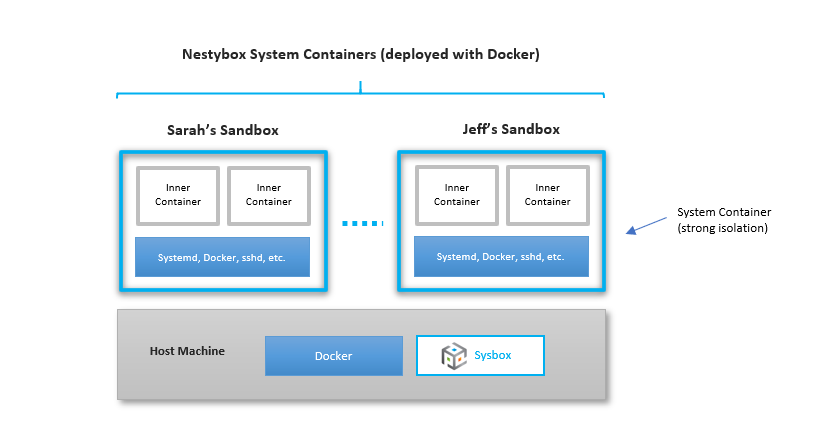

# Sysbox User Guide: Docker-in Docker

## Contents

-   [Intro](#intro)
-   [Installing Docker inside the Container](#installing-docker-inside-the-container)
-   [Running Docker inside the Container](#running-docker-inside-the-container)
-   [Preloading Inner Container Images](#preloading-inner-container-images)
-   [Persistence of Inner Docker Images](#persistence-of-inner-docker-images)
-   [Inner Docker Privileged Containers](#inner-docker-privileged-containers)
-   [Limitations for the Inner Docker](#limitations-for-the-inner-docker)

## Intro

<p align="center"></p>

Sysbox has support for running Docker inside containers (aka Docker-in-Docker).

Unlike all other alternatives, Sysbox enables users to do this **easily and
securely**, without resorting to complex Docker run commands and container
images, and without using privileged containers or bind-mounting the host's
Docker socket into the container. The inner Docker is **totally isolated** from
the Docker on the host.

This is useful for Docker sandboxing, testing, and CI/CD use cases.

## Installing Docker inside the Container

The easiest way is to use a system container image that has Docker preinstalled
in it.

You can find a few such images in the [Nestybox DockerHub repo](https://hub.docker.com/r/nestybox). The
Dockerfiles for the images are [here](https://github.com/nestybox/dockerfiles).

Alternatively, you can always deploy a baseline system container image (e.g.,
ubuntu or alpine) and install Docker in it just as you would on a physical host
or VM.

In fact, the system container images that come with Docker preinstalled are
created with a Dockerfile that does just that.

## Running Docker inside the Container

You do this just as you would on a physical host or VM (e.g., by executing
`docker run -it alpine` inside the container).

The [Sysbox Quickstart Guide](../quickstart/README.md) has several examples showing how
to run Docker inside a system container.

## Preloading Inner Container Images

Sysbox enables you to **easily** create system container images that come preloaded
with inner Docker container images.

This way, when you deploy the system container, the inner Docker images are
already present, and void the need to pull them from the network.

There are two ways to do this:

1) Using `docker build`

2) Using `docker commit`

See the [User Guide System Container Images Chapter](images.md#preloading-inner-container-images-into-a-system-container--v012-)
for a full explanation on how to do this.

## Persistence of Inner Docker Images

Inner container images that are [preloaded](#preloading-inner-container-images)
inside the system container image are persistent: they are present every time a
new system container is created.

However, inner container images that are pulled into the system container at
runtime are not by default persistent: they get destroyed when the system
container is removed (e.g., via `docker rm`).

But it's easy to make these runtime inner container images (and even inner
containers) persistent too.

You do this by simply mounting a host directory into the system container's
`/var/lib/docker` directory (i.e., where the inner Docker stores its container
images).

The Sysbox Quick Start Guide has examples [here](../quickstart/dind.md#persistence-of-inner-container-images-using-docker-volumes)
and [here](../quickstart/dind.md#persistence-of-inner-container-images-using-bind-mounts).

A couple of caveats though:

1) A given host directory mounted into a system container's `/var/lib/docker` must
   only be mounted on a single system container at any given time. This is a
   restriction imposed by the inner Docker daemon, which does not allow its image
   cache to be shared concurrently among multiple daemon instances. Sysbox will
   check for violations of this rule and report an appropriate error during system
   container creation.

2) Do not mount the host's `/var/lib/docker` to a system container's
   `/var/lib/docker`.  Doing so breaks container isolation since the system
   container can now inspect all sibling containers on the host. Furthermore, as
   mentioned in bullet (1) above, you cannot share `/var/lib/docker` across
   multiple container instances, so you can't share the host's Docker cache with
   a Docker instance running inside a sysbox container.

## Inner Docker Privileged Containers

Inside a system container you _can_ deploy privileged Docker containers (e.g.,
by issuing the following command to the inner Docker: `docker run --privileged ...`).

**NOTE: due to a bug in Docker, this requires the inner Docker to be version 19.03 or newer.**

The ability to run privileged containers inside a system container is useful
when deploying inner containers that require full privileges (typically
containers for system services such as Kubernetes control-plane pods).

Note however that a privileged container inside a system container is only
privileged within the context of the system container, but has **no
privileges on the underlying host**.

For example, when running a privileged container inside a system container, the
procfs (i.e., `/proc`) mounted inside the privileged container only allows
access to resources associated with the system container. It does **not** allow
access to all host resources.

This is a unique and key security feature of Sysbox: it allows you to run privileged
containers inside a system container without risking host security.

## Inner Docker Multi-Arch Builds \[ v0.6.7+ ]

Starting with Sysbox v0.6.7, and in hosts with Linux kernel 6.7 or later, it's possible
for a Docker instance running inside a Sysbox container to build multi-arch images.

This is because Linux kernel 6.7 introduces user-namespacing on the `binfmt_misc` filesystem,
thanks to [this kernel commit](https://git.kernel.org/pub/scm/linux/kernel/git/vfs/vfs.git/commit/?h=vfs.binfmt_misc&id=ecddcab2d1b15fea782889237093bd069979c8c7) by the excellent Christian Brauner.
This means that each Sysbox container has a dedicated `binfmt_misc` filesystem that is
independent and isolated from the `binfmt_misc` filesystems on the host or in other
Sysbox containers.

Sysbox v0.6.7 detects if the kernel supports `binfmt_misc` namespacing and if so
it auto-mounts it inside each Sysbox container at `/proc/sys/fs/binfmt_misc`.

This in turn enables applications such as Docker running inside the Sysbox
container to leverage this filesystem for multi-arch use cases, for example
building an arm64 image on an amd64 host as in the example below.

1) Start a Sysbox container that comes with Docker inside:

```
$ docker run --runtime=sysbox-runc -it --rm nestybox/ubuntu-jammy-systemd-docker
```

Now, inside the Sysbox container:

2) Tell the inner Docker to install QEMU for emulation:

```
$ docker run --rm --privileged multiarch/qemu-user-static --reset -p yes
```

3) Verify the installation succeeded:

```
$ docker buildx inspect --bootstrap
Name:   default
Driver: docker

Nodes:
Name:      default
Endpoint:  default
Status:    running
Platforms: linux/amd64, linux/386, linux/arm64, linux/riscv64, linux/ppc64le, linux/s390x, linux/arm/v7, linux/arm/v6
```

4) Tell the inner Docker to build the image (assumes you have a Dockerfile somewhere):

```
$ docker buildx build --platform linux/arm64 -t alpine-arm-test:arm64 .
```

5) Run the newly built image:

```
$ docker run --rm --platform linux/arm64 alpine-arm-test:arm64 uname -m
aarch64
```

Note that steps (2) -> (5) above occur inside the Sysbox container, and they are
exactly the same steps you would do on a normal Linux host. This makes sense
since the environment inside the Sysbox container resembles a Linux VM.

Also, the installation of QEMU for emulation occurs entirely inside the Sysbox
container, and it does not affect the host or other containers (because
`binfmt_misc` is namespaced per Sysbox container).

Finally, as noted above, this requires a Linux kernel version 6.7 or later. On
earlier Linux kernels, Sysbox will not auto-mount `binfmt_misc` inside the
container and in fact trying to mount it manually inside the container
(e.g., `mount -t binfmt_misc binfmt_misc /proc/sys/fs/binfmt_misc`) will
result in a "permission denied" error.

## Limitations for the Inner Docker

Most Docker functionality works perfectly inside the system container.

However, there are some limitations at this time. This section describes these
limitations.

### Inner Docker Data-Root

The inner Docker must store it's images at the usual `/var/lib/docker`. This
directory is known as the Docker "data-root".

While it's possible to configure the inner Docker to store it's images at some
other location within the system container (via the Docker daemon's
`--data-root` option), Sysbox does **not** currently support this (i.e., the
inner Docker won't work).

### Inner Docker userns-remap

The inner Docker must not be configured with [userns-remap](https://docs.docker.com/engine/security/userns-remap/).

Enabling userns-remap on the inner Docker would cause the Linux user-namespace
to be used on the inner containers, further isolating them from the rest of the
software in the system container.

This is useful and we plan to support it in the future.

Note however that even without the inner Docker userns remap, inner containers are
already well isolated from the host by the system container itself, since the
system container uses the Linux user namespace.
