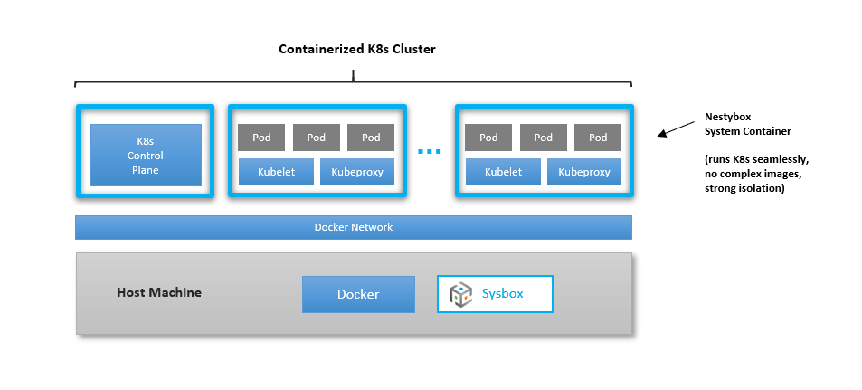

# Sysbox User Guide: Kubernetes-in-Docker

## Contents

-   [Intro](#intro)
-   [Use Cases](#use-cases)
-   [Deploying a K8s Cluster with Sysbox](#deploying-a-k8s-cluster-with-sysbox)
-   [Preloading Inner Pod Images into K8s Node Images](#preloading-inner-pod-images-into-k8s-node-images)
-   [Preliminary Support & Known Limitations](#preliminary-support--known-limitations)

## Intro

Starting with release v0.2.0, Sysbox has preliminary support for running Kubernetes
(K8s) inside system containers. This is known as **Kubernetes-in-Docker** or
**"KinD"**.

There are several [use-cases](#use-cases) for running Kubernetes-in-Docker.

The [Sysbox QuickStart guide](../quickstart/README.md) has step-by-step examples.

Sysbox is capable of creating containers that can run K8s seamlessly, using
simple Docker images, no special configurations, and strongly isolated
containers (i.e,. using the Linux user-namespace).

You can deploy the cluster using simple Docker commands or using a higher
level tool (e.g., Nestybox's "kindbox" tool).

With Sysbox, you have full control of the container images used for K8s
nodes. You can use different images for different cluster nodes if you wish, and
you can easily preload inner pod images into the K8s nodes.

## Use Cases

Some sample use cases for Kubernetes-in-Docker are:

-   Testing and CI/CD:

    -   Use it local testing or in a CI/CD pipeline.

-   Infrastructure-as-code:

    -   The K8s cluster is itself containerized, bringing the power of containers
        from applications down to infrastructure.

-   Increased host utilization:

    -   Run multiple K8s clusters on a single host, with strong isolation and
        without resorting to heavier VMs.

## Deploying a K8s Cluster with Sysbox

Deploying a K8s cluster is as simple as using Docker + Sysbox to deploy one or
more system containers, each with Systemd, Docker, and Kubeadm, and running
`kubeadm init` for the master node and `kubeadm join` on the worker node(s).

See [this example](../quickstart/kind.md#using-docker-to-deploy-a-k8s-cluster) in the Quick Start
Guide for step-by-step instructions.

In addition, you can also use a higher level tool such as [kindbox](https://github.com/nestybox/kindbox)
to deploy the K8s cluster. Kindbox is a simple bash script wrapper around Docker
commands. See [this example](../quickstart/kind.md#using-kindbox) in the Quick
Start Guide for step-by-step instructions.

## Preloading Inner Pod Images into K8s Node Images

A key feature of Sysbox is that it allows you to easily create system container
images that come preloaded with inner container images.

You can use this to create K8s node images that include inner pod images.

This can significantly speed up deployment of the K8s cluster, since K8s node
need not download those inner pod images at runtime.

There are two ways to do this:

-   Using `docker build` (see [here](../quickstart/kind.md#preloading-inner-pod-images-with-docker-build) for an example).

-   Using `docker commit` (see [here](../quickstart/kind.md#preloading-inner-pod-images-with-docker-commit) for an example).

You can use this to embed your own pod images into the K8s-node image too.

## Preliminary Support & Known Limitations

Sysbox's support for running Kubernetes-in-Docker is preliminary at this stage.

This is because Kubernetes is a complex and large piece of software, and not all
K8s functionality works inside system containers yet.

However, many widely used K8s features work, so it's already quite useful.

Below is a list of K8s features that work and those that don't. Anything not
shown in the lists means we've not tested it yet (i.e., it may or may not work).

### Supported Functionality

-   Cluster deployment (single master, multi-worker).

-   Cluster on Docker's default bridge network.

-   Cluster on Docker's user-defined bridge network.

-   Deploying multiple K8s clusters on a single host (each on it's own Docker user-defined bridge network).

-   Kubeadm

-   Kubectl

-   Helm

-   K8s deployments, replicas, auto-scale, rolling updates, daemonSets, configMaps, secrets, etc.

-   K8s CNIs: Flannel, WeaveNet (Sysbox-EE), Calico (Sysbox-EE).

-   K8s services (ClusterIP, NodePort).

-   K8s service mesh (Istio).

-   K8s ingress controller (Traefik).

-   K8s volumes (emptyDir, hostPath, persistent).

-   Kube-proxy (iptables mode only).

### Not yet supported

-   Kube-proxy ipvs mode.

-   K8s NFS volumes
