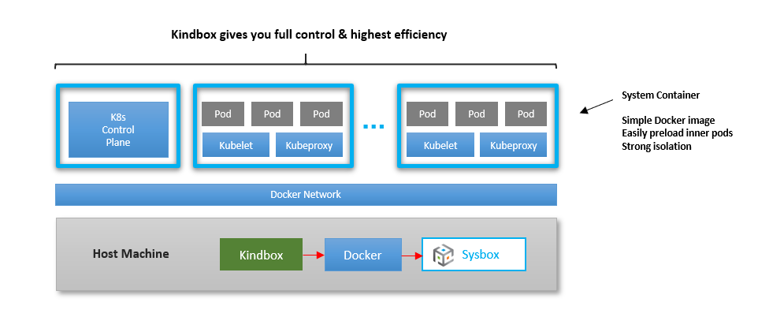

# Sysbox User Guide: Kubernetes-in-Docker

## Contents

-   [Intro](#intro)
-   [Use Cases](#use-cases)
-   [Deploying a K8s Cluster with Sysbox](#deploying-a-k8s-cluster-with-sysbox)
-   [Using K8s.io KinD + Sysbox](#using-k8sio-kind--sysbox)
-   [Using Kindbox](#using-kindbox)
-   [K8s Cluster Deployment with Docker + Sysbox](#k8s-cluster-deployment-with-docker--sysbox)
-   [Preloading Inner Pod Images into K8s Node Images](#preloading-inner-pod-images-into-k8s-node-images)
-   [Performance & Efficiency](#performance--efficiency)
-   [Preliminary Support & Known Limitations](#preliminary-support--known-limitations)

## Intro

Sysbox has preliminary support for running Kubernetes (K8s) inside system
containers. This is known as **Kubernetes-in-Docker** or **"KinD"**.

There are several [use-cases](#use-cases) for running Kubernetes-in-Docker.

The [Sysbox QuickStart guide](../quickstart/README.md) has step-by-step examples.

While it's possible to run Kubernetes-in-Docker without Sysbox, doing so
requires complex Docker images, complex Docker run commands, and very unsecure
privileged containers.

Sysbox is the first container runtime capable of creating containers that can
run K8s seamlessly, using simple Docker images, no special configurations, and
strongly isolated containers (i.e,. using the Linux user-namespace).

You can deploy the cluster using simple Docker commands or using a higher
level tool (e.g., K8s.io KinD or Nestybox's "kindbox" tool).

With Sysbox, you have full control of the container images used for K8s
nodes. You can use different images for different cluster nodes if you wish, and
you can easily preload inner pod images into the K8s nodes.

Last but not least, Sysbox has features that significantly reduce the storage
overhead of the K8s cluster (e.g., from 10GB -> 3GB for a 10-node K8s cluster).
This enables you to deploy larger and/or more K8s clusters on a single host.

## Use Cases

Some sample use cases for Kubernetes-in-Docker are:

-   Deploy Kubernetes clusters quickly and efficiently:

    -   A 10-node K8s cluster can be deployed in under 2 minutes on a small laptop,
        with &lt; 1GB overhead.

-   Testing and CI/CD:

    -   Use it local testing or in a CI/CD pipeline.

-   Infrastructure-as-code:

    -   The K8s cluster is itself containerized, bringing the power of containers
        from applications down to infrastructure.

-   Increased host utilization:

    -   Run multiple K8s clusters on a single host, with strong isolation and
        without resorting to heavier VMs.

## Deploying a K8s Cluster with Sysbox

Deploying a K8s cluster is as simple as using Docker + Sysbox to deploy one or
more system containers, each with Systemd, Docker, and Kubeadm, and running
`kubeadm init` for the master node and `kubeadm join` on the worker node(s).

However, there are higher level tools that make it even easier. We support
two such tools currently:

-   [K8s.io KinD](https://kind.sigs.k8s.io) (slightly modified version)

-   Nestybox's `kindbox`.

Both of these are good choices, but there are some pros / cons between them.

K8s.io KinD offers a more standard way of doing the deployment, but relies on
complex container images and complex Docker commands, making it harder for you
to control the configuration and deployment of the cluster.

On the other hand, `kindbox` is a much simpler, open-source tool which Nestybox
provides as a reference example. It uses simple container images and Docker
commands, giving you **full control** over the configuration and deployment of
the cluster. Kindbox is also the the quickest and most efficient method to
deploy the K8s cluster with Sysbox.

The sections below we show how to deploy a K8s cluster with these tools, as well
as without them (through simple `docker run` commands).

## Using K8s.io KinD + Sysbox

**Check out this [video](https://asciinema.org/a/veCPJJtf0D38Cet2iLOY4j8ry?speed=1.75).**

The [K8s.io KinD](https://kind.sigs.k8s.io) project produces a CLI tool called
"kind" that enables deployment of Kubernetes clusters inside Docker containers.

It's an excellent tool that makes deployment of K8s cluster in containers fast &
easy. The tool takes care of sequencing the creation of the K8s cluster and
configuring the container-based K8s nodes.

When used with Sysbox, the capabilities of the K8s.io kind tool are enhanced:

-   The K8s cluster runs more efficiently (e.g., up to 70% less overhead per node).
    See [Performance & Efficiency](#performance--efficiency) for details.

-   The K8s cluster is properly isolated (no privileged containers!)

-   Sysbox makes it easy to preload the K8s node images with inner pod images
    (via a Dockerfile or Docker commit). This way, when you deploy the cluster,
    pod images of your choice are already embedded in the K8s nodes.

Unfortunately, the K8s.io kind tool does not yet formally support the Sysbox
runtime. Nestybox will be working with the community to add this support.

In the meantime, we forked the K8s.io kind tool [here](https://github.com/nestybox/kind-sysbox)
and made a few changes that enable it to work with Sysbox.

The changes are **very simple**: we just modify the way the K8s.io kind tool invokes
Docker to deploy the K8s node containers. For example, we add
`--runtime=sysbox-runc` to the Docker run command, and remove the `--privileged`
flag. The diffs are [here](https://github.com/nestybox/kind-sysbox/commit/9708a130b7c0a539f2f3b5aa187137e71f747347).

### Modified K8s.io KinD Tool

Here is the process to download and build the forked version of the K8s.io kind
tool:

    $ git clone https://github.com/nestybox/kind-sysbox.git
    $ cd kind-sysbox
    $ make kind-sysbox

The resulting binary is under `bin/kind-sysbox`.

### Modified K8s node image

The K8s.io kind tool uses a custom Docker image for the K8s nodes called
`kindest/node`.

A slightly modified version of this image is needed for Sysbox.

-   NOTE: This should normally not be required, but unfortunately the `runc` binary inside
    the `kindest/node` image has a bug that prevents it from working properly in
    unprivileged containers in some cases. We will be working with the OCI runc
    community to resolve this bug.

The modified image is called `nestybox/kindestnode` and is uploaded in the Nestybox
Dockerhub repo [here](https://hub.docker.com/repository/docker/nestybox/kindestnode).
The Dockerfile is [here](../../dockerfiles/kindestnode).

### Deploying a cluster with K8s.io KinD + Sysbox

Once you've build the forked K8s.io kind tool, you use it as described
in the [kind user manual](https://kind.sigs.k8s.io/docs/user/quick-start/).

The only difference is that you need to explicitly tell the tool to use the
`nestybox/kindestnode` image.

When the kind tool deploys the K8s cluster, the fact that the K8s.io kind tool
is using Docker + Sysbox will not be obvious, except that you'll be able to
deploy K8s nodes with **much higher efficiency and security**.

See [this example](../quickstart/kind.md#using-k8sio-kind--sysbox-kind-sysbox) in the Quick
Start Guide for step-by-step instructions.

## Using Kindbox

[Kindbox](https://github.com/nestybox/kindbox) is a simple open-source tool created by Nestybox
to easily create K8s clusters with Docker + Sysbox.

**Check out this [video](https://asciinema.org/a/Vw8fwWwRJ26dNdMpaU8m5oaTQ?speed=1.75).**

Kindbox does some of the same things that the K8s.io KinD tool does (e.g., cluster
creation, destruction, etc.) but it's much simpler, more flexible, does not
require complex container images, and it's even more efficient.

Kindbox is not meant to compete with the K8s.io KinD tool. Rather, it's meant to
provide a reference example of how easy it is to deploy a K8s cluster inside
containers when using the Sysbox container runtime.

Kindbox is a simple bash script wrapper around Docker commands. Feel free to
modify it to fit your needs.

See [this example](../quickstart/kind.md#using-kindbox) in the Quick Start
Guide for step-by-step instructions.

### Kindbox Simplicity & Flexibility

Kindbox is a very simple and flexible tool: it's a bash script wrapper around
Docker commands that create, destroy, and resize a Kubernetes-in-Docker cluster.

That is, Kindbox talks to Docker, Docker talks to Sysbox, and Sysbox creates or
destroys the containers.

The reason the tool is so simple is that the Sysbox container runtime creates
the containers such that they can run K8s seamlessly inside. Thus, Kindbox need
only deploy the containers with Docker and run `kubeadm` within them to set them
up. **It's that easy**.

For this same reason, no specialized Docker images are needed for the containers
that act as K8s nodes. In other words, the K8s node image does not require
complex entrypoints or complex Docker commands for its deployment.

This in turn enables you to fully control the contents of the images that make
up the k8s nodes, as well as the process for launching the K8s cluster.

## K8s Cluster Deployment with Docker + Sysbox

It's also possible to deploy a K8s cluster directly with Docker + Sysbox,
without using the K8s.io `kind` or Nestybox's `kindbox` tools.

**Check out this [video](https://asciinema.org/a/V1UFSxz6JHb3rdHpGrnjefFIt?speed=1.75).**

The upside is that you get full control of the cluster deployment. The drawback
is that you need to manage the K8s cluster creation sequence. But it's pretty
easy as you'll see.

See [this example](../quickstart/kind.md#using-docker-to-deploy-a-k8s-cluster) in the Quick Start
Guide for step-by-step instructions.

## Preloading Inner Pod Images into K8s Node Images

A key feature of Sysbox is that it allows you to easily create system container
images that come preloaded with inner container images.

You can use this to create K8s node images that include inner pod images.

This can significantly speed up deployment of the K8s cluster, since K8s node
need not download those inner pod images at runtime.

There are two ways to do this:

-   Using `docker build` (see [here](../quickstart/kind.md#preloading-inner-pod-images-with-docker-build) for an example).

-   Using `docker commit` (see [here](../quickstart/kind.md#preloading-inner-pod-images-with-docker-commit) for an example).

Nestybox uses this feature often. For example, we use it to preload inner pods
for the K8s control plane in the `nestybox/k8s-node` image.

You can use this to embed your own pod images into the K8s-node image too.

## Performance & Efficiency

Sysbox enables you to deploy multi-node clusters quickly, efficiently, and
securely inside containers.

The table below compares the latency and storage overhead for deploying a K8s
cluster using the K8s.io `kind` tool (with and without Sysbox), as well as with
Nestybox's `kindbox` tool.

Data is for a 10 node cluster, collected on a small laptop with 4 CPUs and 8GB RAM.

| Metric                | K8s.io KinD | K8s.io KinD + Sysbox | Kindbox |
| --------------------- | :---------: | :------------------: | :-----: |
| Storage overhead      |    10 GB    |         3 GB         |   1 GB  |
| Cluster creation time |    2 min    |         2 min        |  2 min  |

Latency-wise, the cluster creation time is similar (~2 minutes for a 10 node
cluster; not bad!).

But notice the storage overhead reduction when using Sysbox. It's significant (> 70%).

This reduction is possible because Sysbox has features that maximize
[sharing of container image layers](images.md#inner-docker-image-sharing) between
the containers that make up the K8s cluster.

That sharing is even larger when Docker is running inside the container, which
is why the kindbox column shows the lowest overhead (by default kindbox uses the
`nestybox/k8s-node` image which comes with Docker inside).

## Preliminary Support & Known Limitations

Sysbox's support for KinD is preliminary at this stage.

This is because Kubernetes is a complex and large piece of software, and not all
K8s functionality works inside system containers yet.

However, many widely used K8s features work, so it's already quite useful.

Below is a list of K8s features that work and those that don't. Anything not
shown in the lists means we've not tested it yet (i.e., it may or may not work).

### Supported Functionality

-   Cluster deployment (single master, multi-worker).

-   Cluster on Docker's default bridge network.

-   Cluster on Docker's user-defined bridge network.

-   Deploying multiple K8s clusters on a single host (each on it's own Docker user-defined bridge network).

-   Kubeadm

-   Kubectl

-   Helm

-   K8s deployments, replicas, auto-scale, rolling updates, daemonSets, configMaps, secrets, etc.

-   K8s CNIs: Flannel.

-   K8s services (ClusterIP, NodePort).

-   K8s service mesh (Istio).

-   K8s ingress controller (Traefik).

-   K8s volumes (emptyDir, hostPath, persistent).

-   Kube-proxy (iptables mode only).

### Not yet supported

-   Kube-proxy ipvs mode.

-   K8s NFS volumes
